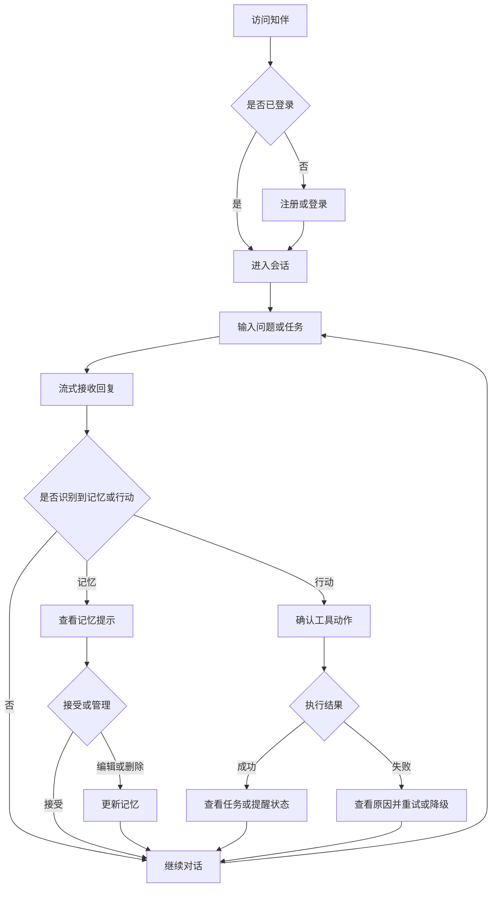

# 知伴产品需求文档

## 1. 文档信息

- 产品名称：知伴（暂名）
- 产品形态：桌面浏览器优先的响应式 Web 应用
- 产品定位：独立、轻量、具备可控记忆和工具能力的通用个人 AI 助理
- 交互参照：借鉴成熟对话式产品的低学习成本交互，但不复制豆包或其他产品
- 目标技术栈：Next.js/React、Python FastAPI、PostgreSQL/pgvector、Redis
- 文档阶段：答辩项目构建前的产品需求基线

本 PRD 定义“做什么、为谁做、做到什么程度”，不展开数据库表、接口字段、Agent 编排代码等技术设计细节。

## 2. 产品愿景

知伴帮助用户把分散在对话中的偏好、信息和行动项持续组织起来。用户只需自然表达，系统即可在知情、可控的前提下记住重要内容，并将请求转化为检索、摘要、待办、提醒、任务跟踪和社交表达等可验证结果。

产品首版追求的不是能力数量，而是一个可信闭环：

> 用户愿意说，知伴记得准；用户要求做，知伴有状态；系统做不到，也会明确说明。

## 3. 产品目标与非目标

### 3.1 产品目标

- 降低用户在不同会话中反复说明个人偏好和背景的成本。
- 让自动记忆对用户可见、可纠正、可删除。
- 以一个统一对话入口完成常见个人信息处理和轻量行动管理。
- 对模型、工具和网络失败提供可理解的状态与恢复方式。
- 形成适合答辩展示、可在本地复现的完整 Web 产品。

### 3.2 非目标

- 不构建豆包或其他成熟平台的复制品。
- 不追求首版覆盖所有个人助理场景。
- 不训练自有基础模型。
- 不在 P0 提供原生移动端、实时语音通话或复杂多模态创作。
- 不替代专业医疗、法律、投资意见。
- 不在 P0 对接真实短信、邮件或系统级推送；应用内提醒即可完成验收。
- 不在 P0 构建多人协作、企业权限、审批、支付或订阅体系。

## 4. 目标用户

### 4.1 核心用户：需要整理日常信息的个人用户

- 经常通过聊天获取信息、整理内容或规划行动。
- 不希望每次重新说明自己的偏好、目标和上下文。
- 需要管理少量待办与提醒，但不想学习复杂项目管理工具。
- 关注个人数据是否被保存，以及能否修改和删除。

### 4.2 次级用户：答辩评审与项目体验者

- 希望快速理解产品价值并完成主路径。
- 会关注记忆如何工作、工具是否真实执行、错误如何处理。
- 需要在有限时间和可能不稳定的网络环境下体验核心功能。

## 5. 核心场景

### 5.1 连续对话与个性化

用户第一次说明“我偏好简洁回答，最近在准备毕业答辩”。后续新会话中，知伴在相关问题里采用简洁表达，并结合答辩背景提出建议；同时允许用户查看这两条记忆的来源并纠正。

### 5.2 对话转行动

用户说“周五前完成演示稿，明晚提醒我先整理结构”。知伴识别待办和提醒，在用户确认后保存，并在任务列表与应用内提醒中心展示真实状态。

### 5.3 检索与摘要

用户要求检索一个主题，知伴返回带来源的结果摘要；用户也可以粘贴一段内容或网址请求摘要，再将行动项转为待办。

### 5.4 任务持续跟踪

用户询问“我的答辩准备得怎么样”，知伴基于已保存任务汇总完成、进行中和逾期项，而不是凭聊天内容猜测。

### 5.5 社交表达辅助

用户描述沟通对象、目的和语气，知伴生成消息草稿；若用户偏好已记录，可应用该偏好。草稿默认不自动发送。

### 5.6 失败与恢复

外部搜索不可用时，知伴明确说明未完成在线检索，允许重试或使用离线演示数据；不能把模型已有知识伪装成刚刚检索到的结果。

## 6. 用户旅程

### 6.1 首次使用旅程

1. 用户完成注册或登录。
2. 空状态用简短示例提示可进行聊天、记忆和任务操作。
3. 用户发送首条消息，回复以流式方式展示。
4. 若系统识别到稳定偏好或用户明确要求记住，界面展示记忆结果。
5. 用户可进入记忆页查看、编辑或删除。
6. 用户再次对话，系统在相关场景使用该记忆，并提供低干扰的使用提示。

### 6.2 行动任务旅程

1. 用户在对话中提出待办、提醒或跟踪请求。
2. 知伴展示结构化动作预览，包含标题、时间和必要字段。
3. 对有副作用或信息不完整的动作，用户补充或确认。
4. 系统执行并返回确定状态。
5. 用户可在任务页继续查看、完成、修改或取消。
6. 失败时保留用户输入，解释原因并提供重试或手动保存。

## 7. 范围与优先级

### 7.1 P0：答辩可交付闭环

P0 必须在本地答辩环境可运行。模型、网页检索等外部依赖不可用时，可切换到明确标识的离线/Mock 模式；Mock 必须复用同一产品流程、可重复返回固定结果，不得伪装成真实在线服务。

- 登录、退出及最小账号隔离。
- 新建、查看、重命名和删除会话。
- SSE 流式聊天、停止生成、重试和基础多轮上下文。
- 显式记忆、自动记忆候选和记忆使用提示。
- 记忆列表、查看、编辑、删除和基本搜索。
- 待办与单次应用内提醒的创建、查看、完成和取消。
- 网页检索及来源展示；离线模式使用固定检索语料。
- 文本摘要和检索结果摘要。
- 基于待办状态的基础任务跟踪。
- 社交消息草稿生成，不自动发送。
- 设置与隐私控制。
- 加载、空状态、超时、断网、模型失败和工具失败兜底。
- 预置答辩账号或初始化数据方案，以及可识别的演示模式状态。

### 7.2 P1：增强体验

- 记忆合并建议、冲突提示和按类型筛选。
- 重复提醒、提醒稍后处理和逾期补偿提示。
- 网址正文抓取与长文分段摘要。
- 任务拆解、进度备注和按目标聚合。
- 检索来源选择、时间范围和结果反馈。
- 社交草稿多版本、语气调整和基于历史偏好的改写。
- 会话内工具执行历史与更细的恢复操作。
- 数据导出和整账号数据删除。

### 7.3 P2：远期探索

- 语音输入与朗读。
- 图片、文档等多模态输入。
- 日历、邮件和第三方任务平台集成。
- 多步骤自动化工作流。
- 多设备通知和原生移动端。
- 主动建议与周期性个人回顾。

## 8. 详细功能需求

### 8.1 账号与登录

- **FR-001 [P0]** 系统应支持用户使用账号标识与密码完成注册；若答辩版采用预置账号，仍应提供清晰的登录入口和凭据说明。
- **FR-002 [P0]** 系统应支持登录、退出和会话保持，刷新页面后登录状态在有效期内保持。
- **FR-003 [P0]** 登录失败时应使用统一提示，不向未认证用户泄露账号是否存在。
- **FR-004 [P0]** 所有会话、记忆、任务和提醒页面在未登录时应跳转到登录页。
- **FR-005 [P0]** 用户退出后，当前浏览器不应继续访问受保护数据。
- **FR-006 [P1]** 用户可发起整账号数据删除，并在明确确认后删除或匿名化其个人数据。

### 8.2 会话管理与 SSE 流式聊天

- **FR-010 [P0]** 用户可创建新会话，并在会话列表查看自己的历史会话。
- **FR-011 [P0]** 用户可重命名和删除会话；删除前需确认，删除后不再出现在列表与检索结果中。
- **FR-012 [P0]** 用户发送消息后，系统应立即显示用户消息和回复占位状态。
- **FR-013 [P0]** 助理回复应通过 SSE 增量展示，并明确区分生成中、已完成、已停止和失败状态。
- **FR-014 [P0]** 用户可停止正在生成的回复；停止后已生成内容可保留，但不得显示为完整成功结果。
- **FR-015 [P0]** 用户可对失败或已停止的回复发起重试，系统应避免重复创建已成功的待办、提醒等副作用。
- **FR-016 [P0]** 系统应支持多轮对话，并优先遵循用户当前明确指令，不应让旧上下文或旧记忆覆盖当前意图。
- **FR-017 [P0]** 页面刷新后应恢复已持久化消息；未完成消息须显示实际状态，不得补造成已完成。
- **FR-018 [P0]** 回复涉及工具调用时，应在对话中展示可理解的工具状态，如“正在检索”“已创建待办”“检索失败”。
- **FR-019 [P1]** 用户可在会话内查看被使用的来源、记忆和工具结果摘要，但不展示模型内部思维链。

### 8.3 自动与显式记忆

- **FR-020 [P0]** 当用户明确使用“记住”“以后请按此偏好”等表达时，系统应将其识别为显式记忆请求。
- **FR-021 [P0]** 系统可从对话中识别稳定偏好、习惯、长期目标和重要背景作为自动记忆候选。
- **FR-022 [P0]** 一次性问题、验证码、密码、访问令牌及明显敏感凭据不得自动保存为长期记忆。
- **FR-023 [P0]** 自动记忆成功后，系统应以低干扰方式告知用户保存了什么，并提供查看或撤销入口。
- **FR-024 [P0]** 显式记忆请求若成功，应明确确认；若内容不适合保存，应说明原因，不得假装已记住。
- **FR-025 [P0]** 每条记忆应包含用户可理解的内容、类型、创建或更新时间及来源会话信息。
- **FR-026 [P0]** 写入前应处理明显重复；相同事实不得因多次对话无限新增。
- **FR-027 [P0]** 回答当前问题时，系统应仅使用与意图相关且属于当前用户的有效记忆。
- **FR-028 [P0]** 当回复实质依赖长期记忆时，界面应提供“使用了记忆”的可查看提示。
- **FR-029 [P0]** 用户明确纠正已保存事实时，系统应提出更新或删除相关记忆，而不是只在当前回复中临时忽略。
- **FR-030 [P1]** 对互相冲突的记忆，系统应提示用户选择保留、合并或替换。
- **FR-031 [P1]** 系统可根据记忆类型、更新时间和使用反馈降低陈旧记忆的优先级。

### 8.4 记忆管理

- **FR-040 [P0]** 用户可在独立记忆页查看自己的记忆列表。
- **FR-041 [P0]** 用户可按关键词搜索记忆，并看到记忆类型和更新时间。
- **FR-042 [P0]** 用户可打开记忆详情，查看正文、类型、来源和最近更新时间。
- **FR-043 [P0]** 用户可编辑记忆内容；保存后新内容应在后续相关对话中生效。
- **FR-044 [P0]** 用户可删除单条记忆；删除前需确认，删除后不得继续参与检索和回答。
- **FR-045 [P0]** 用户可撤销刚刚发生的自动记忆写入。
- **FR-046 [P1]** 用户可按偏好、习惯、目标、背景等类型筛选记忆。
- **FR-047 [P1]** 用户可导出个人记忆为可读文件。

### 8.5 待办与提醒

- **FR-050 [P0]** 用户可通过自然语言创建待办，系统至少提取标题和可选截止时间。
- **FR-051 [P0]** 对关键信息缺失或存在歧义的待办，系统应请求补充或展示确认卡片。
- **FR-052 [P0]** 用户可创建带明确日期和时间的单次应用内提醒。
- **FR-053 [P0]** 系统应使用用户设置的时区解释提醒时间，并在确认时展示完整时间。
- **FR-054 [P0]** 对过去时间、无效日期或含糊时间，系统应提示用户修正，不得静默创建错误提醒。
- **FR-055 [P0]** 用户可在任务页查看待办与提醒的待处理、已完成、已取消和逾期状态。
- **FR-056 [P0]** 用户可完成、编辑或取消尚未结束的待办和提醒。
- **FR-057 [P0]** 到达提醒时间后，系统应在应用内提醒中心显示提醒；若用户当时离线，应在下次进入时显示未读或已逾期状态。
- **FR-058 [P0]** 创建、修改和取消操作必须以服务端返回状态为准，对话文本不得提前宣称成功。
- **FR-059 [P0]** 同一次工具执行重试不得产生重复待办或提醒。
- **FR-060 [P1]** 用户可创建重复提醒，并查看下一次触发时间。
- **FR-061 [P1]** 用户可将提醒稍后处理，并选择预设或自定义延后时间。

### 8.6 网页检索

- **FR-070 [P0]** 用户可在对话中明确要求网页检索，系统也可在问题依赖近期信息时建议检索。
- **FR-071 [P0]** 检索结果应展示标题、来源链接和摘要，最终回答应能区分来源事实与模型归纳。
- **FR-072 [P0]** 用户点击来源时应打开对应链接，不得生成无法追溯的虚假来源。
- **FR-073 [P0]** 在线检索超时或不可用时，应明确说明未完成在线检索，并提供重试。
- **FR-074 [P0]** 答辩离线模式应使用预置、可追溯的固定语料返回 Mock 检索结果，并在界面持续标识“演示数据”。
- **FR-075 [P0]** 未执行在线检索时，不得使用“刚刚搜索到”“最新结果显示”等措辞。
- **FR-076 [P1]** 用户可限制检索时间范围或选择特定来源。
- **FR-077 [P1]** 用户可对检索结果的相关性提供反馈。

### 8.7 内容摘要

- **FR-080 [P0]** 用户可粘贴文本并要求生成摘要。
- **FR-081 [P0]** 用户可要求摘要采用要点、简短概述或行动项格式。
- **FR-082 [P0]** 对网页检索结果，系统可生成带来源关联的综合摘要。
- **FR-083 [P0]** 输入为空、过短、超出支持长度或无法读取时，应明确提示并保留用户可修改的输入。
- **FR-084 [P0]** 摘要不得宣称包含未成功读取的网页或内容。
- **FR-085 [P0]** 用户可将摘要中的行动项选择性转为待办，转换前展示预览。
- **FR-086 [P1]** 用户可提交网址并由系统读取正文后摘要；读取失败时可改为粘贴文本。
- **FR-087 [P1]** 长内容可按章节生成摘要，并提供整体结论。

### 8.8 任务跟踪

- **FR-090 [P0]** 任务页应按状态展示用户自己的任务，并支持基础排序。
- **FR-091 [P0]** 用户询问任务进度时，系统应基于已保存任务状态回答，并注明逾期、临近截止和已完成数量。
- **FR-092 [P0]** 用户可在对话或任务页更新任务状态。
- **FR-093 [P0]** 任务状态更新失败时，原状态应保持，并向用户提供重试。
- **FR-094 [P1]** 用户可将多个任务归入同一目标，并查看目标级进度。
- **FR-095 [P1]** 用户可添加进度备注，知伴可据此生成阶段总结。
- **FR-096 [P1]** 知伴可建议将大任务拆分为子任务，但必须由用户确认后保存。

### 8.9 社交辅助

- **FR-100 [P0]** 用户可描述对象、目的、背景和期望语气，生成一份社交消息草稿。
- **FR-101 [P0]** 草稿应明确标识为建议内容，不代表已发送。
- **FR-102 [P0]** 知伴可在用户授权的情况下应用已保存的称呼或表达偏好。
- **FR-103 [P0]** 用户可要求草稿更正式、更简洁、更委婉或更直接。
- **FR-104 [P0]** P0 不提供自动发送能力，界面不得出现“已发送”的虚假状态。
- **FR-105 [P1]** 用户可比较多个草稿版本，并选择其一继续修改。

### 8.10 设置与隐私

- **FR-110 [P0]** 用户可设置界面语言、时区和基础回答偏好。
- **FR-111 [P0]** 用户可开启或关闭自动记忆；关闭后仍可使用显式“记住”指令。
- **FR-112 [P0]** 用户可进入隐私说明页，了解会保存的数据类别、用途和可执行的控制操作。
- **FR-113 [P0]** 用户可从设置页快速进入会话、记忆和任务管理入口。
- **FR-114 [P0]** 演示模式启用时，所有受影响界面应持续展示清晰标识，并说明哪些外部能力为 Mock。
- **FR-115 [P1]** 用户可导出自己的会话、记忆和任务数据。
- **FR-116 [P1]** 用户可配置记忆保留偏好和默认摘要风格。

### 8.11 错误兜底与失败体验

- **FR-120 [P0]** 模型请求超时、限流或不可用时，应展示错误类别、可重试操作和不丢失用户输入的保证。
- **FR-121 [P0]** 工具参数校验失败时，不执行工具，并引导用户补充必要信息。
- **FR-122 [P0]** 工具执行超时或失败时，应将动作标记为失败或未知，不得标记成功。
- **FR-123 [P0]** 系统应限制单次请求的工具调用轮次；达到限制后停止并说明无法继续自动完成。
- **FR-124 [P0]** 浏览器断网或 SSE 中断时，应停止等待状态、保留已接收内容，并提供重新连接或重试。
- **FR-125 [P0]** 页面级异常应提供返回会话、刷新或重试入口，不显示空白页。
- **FR-126 [P0]** 对无法安全解析的模型结构化输出，系统应重试或降级为不执行动作的普通说明。
- **FR-127 [P0]** 当部分步骤成功、部分失败时，应逐项展示实际结果，不使用笼统的“全部完成”。
- **FR-128 [P0]** 服务不可用时，用户仍应能够查看已加载或已持久化的历史数据；无法保证时应明确说明。
- **FR-129 [P1]** 用户可从工具失败卡片修改参数后重新执行，而无需重输完整对话。

## 9. 非功能需求

- **NFR-001 [P0] 性能** 正常本地环境下，用户消息发送后应在 1 秒内出现发送成功或处理中反馈；在线模型首个流式片段目标为 3 秒内，超出 10 秒须展示仍在处理或超时状态。
- **NFR-002 [P0] 性能** 常用会话、记忆和任务列表在典型答辩数据量下目标为 2 秒内完成可交互渲染。
- **NFR-003 [P0] 可靠性** 任务、提醒和记忆的成功状态必须在持久化完成后返回，页面刷新后状态一致。
- **NFR-004 [P0] 可靠性** 服务重启后，已保存会话、记忆、任务和提醒不得丢失。
- **NFR-005 [P0] 一致性** 每个 Agent 运行应有唯一标识，便于关联消息、模型调用、工具调用和错误。
- **NFR-006 [P0] 可恢复性** 可重试操作应尽量幂等；用户重复点击或网络重传不得创建重复副作用。
- **NFR-007 [P0] 可维护性** 新增工具应遵循统一输入、输出、权限、超时和错误约定，不要求修改无关业务模块。
- **NFR-008 [P0] 可测试性** 核心领域逻辑、用户隔离、记忆读写、工具失败和关键主路径应具备自动化测试。
- **NFR-009 [P0] 可观测性** 服务端日志应记录时间、运行标识、匿名化用户标识、阶段、耗时和错误类别，不记录密码、令牌或完整敏感正文。
- **NFR-010 [P0] 兼容性** 支持当前主流桌面版 Chrome、Edge 和 Safari；移动浏览器至少能完成登录、聊天和查看任务。
- **NFR-011 [P0] 部署性** 项目应提供环境变量示例、依赖安装、数据库迁移、启动、测试和演示模式说明。
- **NFR-012 [P0] 成本控制** 系统应限制单次上下文长度、检索条数、工具结果长度和 Agent 最大轮次。
- **NFR-013 [P0] 演示性** P0 应能在无公网或外部额度不可用时通过 Mock 模式完成登录、流式对话、记忆、检索、摘要和任务主线。
- **NFR-014 [P0] 模式透明** 在线、离线和 Mock 状态必须对用户可见，且日志和结果不得混淆。
- **NFR-015 [P1] 数据可迁移性** 用户导出内容应采用常见、可读格式，并包含必要的时间与类型信息。

## 10. 隐私与安全需求

- **SEC-001 [P0]** 密码必须采用业界认可的单向密码哈希算法保存，不得明文存储或记录。
- **SEC-002 [P0]** 模型 API 密钥、数据库凭据和签名密钥仅保存在服务端配置中，不得暴露给浏览器或提交到代码仓库。
- **SEC-003 [P0]** 所有受保护 API 必须在服务端验证身份，不能仅依赖前端隐藏页面。
- **SEC-004 [P0]** 会话、消息、记忆、任务、提醒和工具运行记录的读取与修改必须校验资源归属。
- **SEC-005 [P0]** 向量记忆检索必须先限定当前用户范围，不能仅在召回后由应用层过滤。
- **SEC-006 [P0]** Redis 键、缓存和后台任务载荷必须包含不可混淆的用户或资源边界，并设置必要的过期时间。
- **SEC-007 [P0]** 日志、错误信息和分析事件不得包含密码、访问令牌、完整会话正文或不必要的个人敏感信息。
- **SEC-008 [P0]** 用户提交的网址和网页内容视为不可信输入；系统不得因页面指令泄露系统提示词、凭据或其他用户数据。
- **SEC-009 [P0]** 所有工具参数在执行前必须经过服务端类型、范围和权限校验。
- **SEC-010 [P0]** 具有副作用的创建、修改和删除操作应防止跨站请求、重复提交和越权调用。
- **SEC-011 [P0]** 删除记忆后，应从正常读取和检索路径立即不可见；缓存应同步失效。
- **SEC-012 [P0]** 自动记忆默认排除密码、令牌、验证码等凭据；发现疑似内容时不保存并提醒用户。
- **SEC-013 [P0]** 提交给外部模型或检索服务的数据应遵循最小必要原则，隐私说明中须披露相关数据流向。
- **SEC-014 [P0]** 登录和高成本模型接口应具备基础频率限制，避免暴力尝试和资源滥用。
- **SEC-015 [P1]** 用户请求删除账号后，系统应在约定时间内清除或匿名化关联数据，并反馈处理结果。
- **SEC-016 [P1]** 用户可导出其数据处理记录摘要，了解主要数据类别及更新时间。

## 11. 可访问性需求

- **NFR-020 [P0]** 登录、会话、记忆、任务和设置的核心操作均可使用键盘完成。
- **NFR-021 [P0]** 所有表单控件、图标按钮和状态提示应有可被辅助技术识别的名称。
- **NFR-022 [P0]** 文本和关键控件颜色对比度应满足 WCAG 2.1 AA 的常规要求，不仅用颜色表达成功、失败或选中状态。
- **NFR-023 [P0]** 流式新增内容不应持续抢夺焦点；屏幕阅读器应能获知生成开始、完成和失败状态。
- **NFR-024 [P0]** 错误提示应与对应字段或操作关联，并提供文字说明和恢复动作。
- **NFR-025 [P0]** 页面在 200% 缩放下仍可完成核心操作，不出现必须横向滚动才能使用的主流程。
- **NFR-026 [P1]** 用户可选择减少非必要动画，界面遵循系统的减少动态效果偏好。

## 12. 分析指标与事件

答辩项目的分析目标是验证核心闭环和定位失败，不以增长指标包装产品价值。分析数据应遵循最小收集原则。

### 12.1 核心指标

- 首次价值达成率：新用户是否完成“首次提问并收到有效回复”。
- 记忆闭环完成率：是否成功创建记忆，并在后续相关对话中召回。
- 记忆纠错率：用户编辑、删除或撤销自动记忆的比例，用于发现误记。
- 工具成功率：按工具类型统计成功、失败、超时和取消。
- 行动转化率：对话中提出的待办或提醒，最终确认并成功保存的比例。
- 流式完成率：开始生成后正常完成、用户停止、断线和服务失败的比例。
- 恢复成功率：失败后通过重试、修改参数或降级完成任务的比例。
- P0 主旅程完成率：登录到记忆召回再到任务创建的完整路径是否完成。

### 12.2 事件要求

- **NFR-030 [P0]** 系统应记录不含消息正文的核心产品事件，包括登录结果、消息发送、流式结果、记忆创建或管理、工具结果和任务状态变更。
- **NFR-031 [P0]** 每个事件应包含事件名、时间、匿名化用户标识、会话或运行标识、模式和结果状态。
- **NFR-032 [P0]** 线上服务、离线模式和 Mock 模式的事件必须可区分。
- **NFR-033 [P0]** 用户内容、检索原文和社交草稿默认不进入分析事件属性。
- **NFR-034 [P1]** 应提供最小内部统计视图或可复现查询，用于展示核心路径成功率和主要错误类别。

## 13. 明确验收标准

### 13.1 登录与隔离

- **AC-001** 给定有效账号，用户登录后可进入会话页；刷新后在有效期内仍保持登录。
- **AC-002** 给定无效凭据，登录失败提示不暴露账号是否存在。
- **AC-003** 给定用户 A 和用户 B，A 无法通过页面或直接请求读取、修改、删除 B 的会话、记忆、任务和提醒。
- **AC-004** 用户退出后再次访问受保护页面或 API 时，被要求重新登录。

### 13.2 会话与流式聊天

- **AC-010** 用户发送消息后能看到增量回复，界面依次呈现生成中和已完成状态。
- **AC-011** 用户停止生成后不再接收新片段，已有片段被标记为已停止而非完整成功。
- **AC-012** SSE 中断后，界面在合理时间内结束加载状态、保留已收到内容并提供重试。
- **AC-013** 页面刷新后已完成消息保持一致，未完成消息不会被展示为已完成。
- **AC-014** 对同一失败回复重试时，已成功创建的待办或提醒不会重复生成。

### 13.3 记忆闭环

- **AC-020** 用户明确说“记住我喜欢简洁回答”后，系统确认保存，记忆页可查看该内容及来源。
- **AC-021** 在新会话提出相关问题时，回复采用该偏好，并可查看“使用了记忆”的提示。
- **AC-022** 用户编辑该记忆后，后续相关回复使用新内容，不再使用旧内容。
- **AC-023** 用户删除该记忆后，记忆页不再显示，后续检索与回答不再使用该记忆。
- **AC-024** 用户发送疑似密码、令牌或验证码时，系统不自动保存为长期记忆。
- **AC-025** 同一偏好被重复表达时，不产生不可控的重复记忆。

### 13.4 待办、提醒与跟踪

- **AC-030** 用户说“周五前完成演示稿”，确认后任务页出现一个带正确截止日期的待办。
- **AC-031** 用户设置含糊或已过去的提醒时间时，系统要求澄清或修正，不创建错误提醒。
- **AC-032** 到达提醒时间后，应用内提醒中心出现提醒；用户离线后再次进入仍能看到未处理状态。
- **AC-033** 用户完成或取消任务后，任务页和后续对话查询均反映同一状态。
- **AC-034** 工具保存失败时，对话不显示“已创建”，且用户输入和可重试入口保留。
- **AC-035** 用户询问“任务进展”时，回答中的数量和状态与持久化任务列表一致。

### 13.5 检索与摘要

- **AC-040** 在线检索成功时，回复至少展示可打开的来源标题与链接，且摘要能追溯到来源。
- **AC-041** 在线检索不可用时，系统明确表示未完成检索，不将模型知识伪装成检索结果。
- **AC-042** 离线答辩模式下，固定语料可完成检索和摘要流程，页面持续显示“演示数据”标识。
- **AC-043** 用户粘贴文本后可得到指定格式摘要，并可选择行动项创建待办。
- **AC-044** 网页读取失败时，系统不声称已摘要该网页，并建议用户粘贴正文或重试。

### 13.6 社交辅助与设置

- **AC-050** 用户指定对象、目的和语气后能得到对应草稿，界面明确标识草稿未发送。
- **AC-051** 用户要求调整语气后生成新版本，原始目的和关键事实不被无故改变。
- **AC-052** 用户关闭自动记忆后，普通对话不再自动写入长期记忆，但显式“记住”仍可用。
- **AC-053** 用户修改时区后，新提醒按新时区解释并展示完整日期时间。
- **AC-054** 演示模式开启后，用户无需查看文档即可从界面识别哪些外部能力为 Mock。

### 13.7 失败体验、质量与安全

- **AC-060** 模型超时、限流、空响应和结构化解析失败均有可理解提示，不出现无限加载或空白页。
- **AC-061** 工具收到缺失或非法参数时不执行副作用，并提示需要补充的内容。
- **AC-062** 达到工具调用轮次上限后系统停止执行，说明未完成部分并提供下一步。
- **AC-063** 两个用户使用相同语义记忆查询时，只能召回各自数据。
- **AC-064** 浏览器网络面板和前端构建产物中不包含模型密钥、数据库凭据或服务端签名密钥。
- **AC-065** 日志抽查不包含明文密码、令牌、完整会话正文或完整社交草稿。
- **AC-066** 按运行说明在全新本地环境完成安装、迁移、启动和 P0 主路径演示。
- **AC-067** 断开公网后启用 Mock 模式，仍可完成登录、流式聊天、记忆创建与召回、检索摘要和待办创建。
- **AC-068** 使用键盘可完成登录、发送消息、查看与删除记忆、完成任务和修改设置。
- **AC-069** 核心自动化测试可重复运行，并覆盖用户隔离、记忆管理、工具失败和至少一条端到端主路径。

## 14. 答辩演示验收路径

建议使用一条 8 至 12 分钟的固定主路径验证 P0：

1. 登录测试账号，创建新会话。
2. 输入“记住我偏好简洁回答，我正在准备 AI 个人助理答辩”。
3. 查看记忆写入提示，并在记忆页确认来源和内容。
4. 新建会话询问“帮我规划今天的准备重点”，验证相关记忆被使用。
5. 发起网页检索并生成带来源摘要；无网时使用有明确标识的固定演示语料。
6. 将摘要中的一个行动项创建为待办，并设置单次应用内提醒。
7. 在任务页完成待办，再通过对话询问进度，验证状态一致。
8. 生成一条向老师说明进展的礼貌消息草稿，确认没有自动发送。
9. 删除或纠正一条记忆，验证后续不再使用旧内容。
10. 触发一次工具失败，展示参数修正、重试或降级。
11. 切换另一测试账号，验证第一账号的数据不可见。

## 15. 发布门槛

P0 可进入答辩候选版本前，必须满足：

- 所有 P0 功能有可操作入口，主旅程不存在阻断性问题。
- AC-001 至 AC-069 中与已纳入 P0 的验收项通过；若存在例外，必须记录原因、影响和现场规避方式。
- 在线模式与 Mock 模式均完成一次完整演示回归。
- 用户隔离、密钥不下发和敏感日志检查通过。
- 服务重启、SSE 中断和至少一种工具失败完成手动或自动验证。
- 运行说明可在全新环境复现。
- 已知限制在产品或答辩材料中如实说明。

## 16. 本阶段决策

- 产品暂名“知伴”，采用通用对话入口与结构化行动卡片，不复制豆包。
- P0 以可控记忆为核心差异点，并串联检索、摘要、待办、提醒和任务跟踪。
- 自动记忆默认可关闭，所有记忆均可查看、编辑、删除；敏感凭据不自动记忆。
- 工具执行结果以服务端持久状态为准，回复文本不能替代真实状态。
- 社交辅助首版仅生成草稿，不做自动发送。
- 提醒首版以单次应用内提醒为验收边界。
- P0 必须支持明确标识的离线/Mock 外部依赖演示。
- 隐私、安全、可访问性和失败体验均作为 P0 验收内容，而非发布后的补充项。
- 分析指标用于验证闭环与定位错误，不收集不必要的用户正文。

## 17. 待构建阶段验证项

- 注册与登录采用自助注册还是预置答辩账号，及其最终交互文案。
- 自动记忆的候选规则、确认阈值、去重与冲突处理是否满足实际准确度。
- 回答中“使用了记忆”提示的展示频率和干扰程度。
- SSE 首片延迟与列表性能目标在选定模型和部署环境中是否可达。
- 应用内提醒的后台调度、重启恢复、时区和离线补偿实现是否满足 AC-032。
- 网页检索供应方、来源引用格式、离线固定语料和 Mock 切换方式。
- 文本和网页摘要的最大输入长度及超限交互。
- 任务、提醒和记忆删除采用软删除还是硬删除，以及缓存失效时限。
- 数据分析事件的存储方式、保留周期和本地答辩展示方法。
- WCAG 2.1 AA 对比度、键盘路径和屏幕阅读器状态播报的实际检查结果。
- P1 数据导出与账号删除是否纳入最终答辩版本。
- 正式部署环境、域名、HTTPS、模型额度和公网条件。
