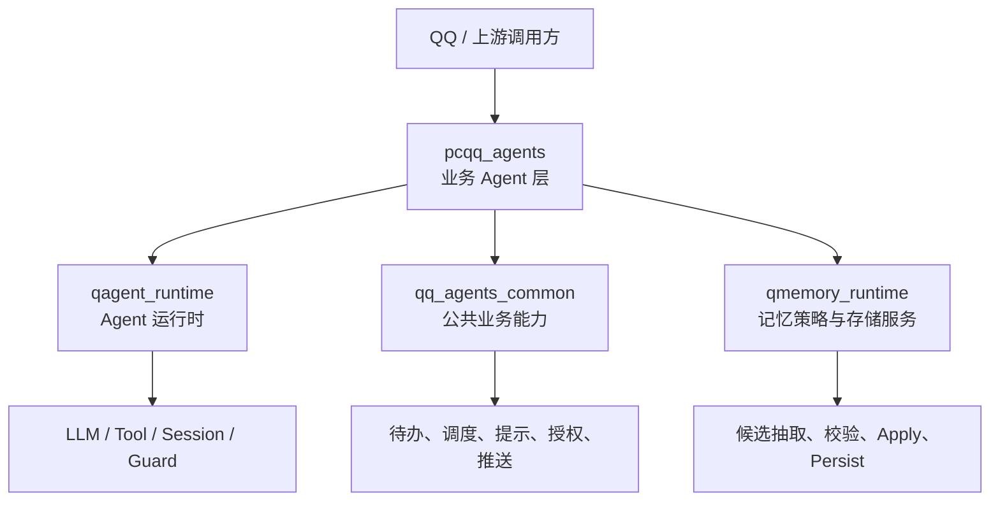
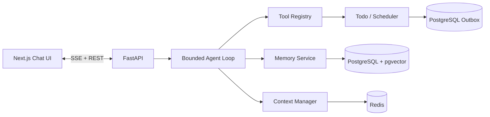
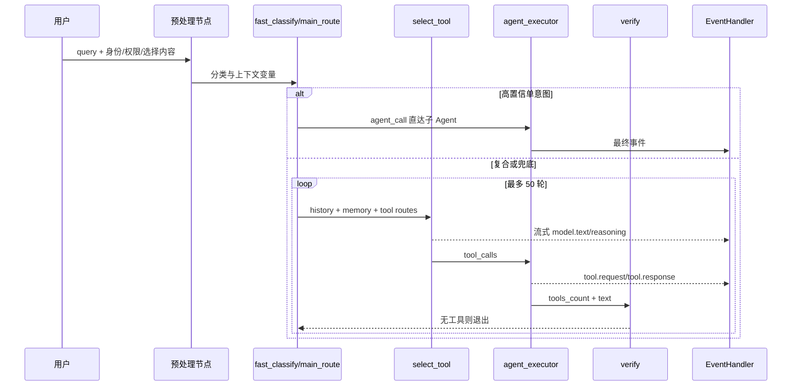
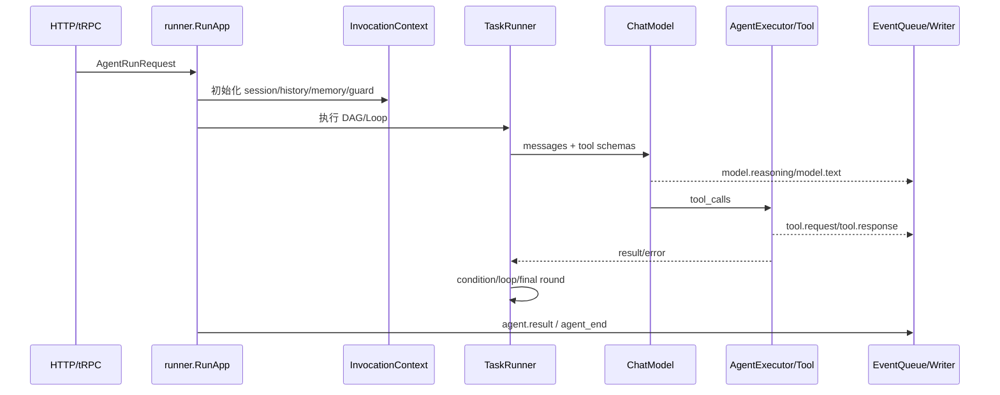
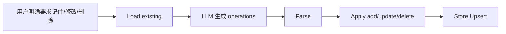
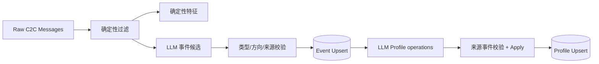
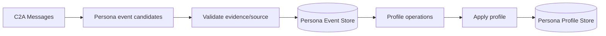
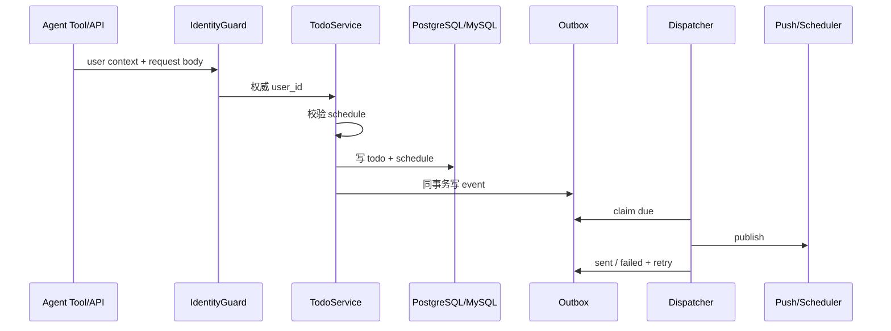
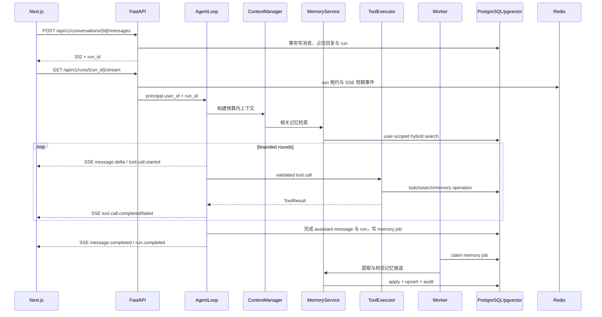

# 四个参考仓库深度源码分析与项目取舍

> 目标项目：答辩项目“类似豆包的通用个人 AI 助理”  
> 目标技术栈：Next.js/React + FastAPI + PostgreSQL/pgvector + Redis  
> 约束：独立轻量实现，不直接依赖腾讯内部包、协议或基础设施  
> 分析时间：2026-08-17

## 0. 阅读约定

本文刻意区分三种陈述：

- **[源码事实]**：已由当前本地源码、配置或测试直接证明。
- **[目标决策]**：面向本答辩项目的设计取舍，不代表参考仓库本身的结论。
- **[待验证假设]**：源码呈现出风险信号，但尚未通过完整构建、运行或生产数据验证。

README、设计文档和注释只作为导航或设计意图证据；若没有实现或测试交叉印证，不把其声明提升为“已实现事实”。

---

## 1. 分析范围、证据等级与结论摘要

### 1.1 分析范围

本次直接阅读四个本地仓库：

1. `/Users/zzming/project/pcqq_agents`
2. `/Users/zzming/project/qmemory_runtime/strategies`，并按需扩展到同仓的 `core/`、`schema/`、`internal/`、`server/`
3. `/Users/zzming/project/qq_agents_common`
4. `/Users/zzming/project/qagent_runtime`

题目依据：`/Users/zzming/work/subject.md`。题目要求的核心是“具备记忆能力的个人 AI 助理”，考察记忆写入与检索、多轮上下文、工具调用稳定性、模型不确定性兜底、数据隔离、安全和测试质量，而不是复刻腾讯内部业务。

未做事项：

- 未运行四仓全量测试；这些仓库依赖内部 tRPC、OIDB、Rainbow、Polaris、Galileo、Atta 等环境，静态分析更适合本轮“参考模式提炼”。
- 未把 README 中的规模数字、生产效果或 SLA 当成源码事实。
- 未分析与目标无直接关系的所有 QQ 业务工具和全部子 Agent。

### 1.2 证据等级

| 等级 | 定义 | 可支撑的结论 |
|---|---|---|
| A | 实现代码与对应测试同时存在，或多条独立调用链互相印证 | 可作为目标项目设计基线 |
| B | 实现代码明确，但未发现对应测试或未运行验证 | 可借鉴，接入前需补测试 |
| C | README、设计文档、注释、未接线代码或局部搜索结果 | 仅作设计意图或风险线索 |

本文中的关键证据以绝对路径和符号名给出，便于答辩时回溯。

### 1.3 总体结论

**[源码事实]** 四仓形成清晰但企业化程度很高的分层：



- `pcqq_agents`：业务 Agent 层，负责路由、Prompt、工具组合、权限提示、输出渲染。
- `qagent_runtime`：运行时，负责有界执行、工具协议、Hook、流式事件、上下文与安全。
- `qmemory_runtime`：记忆策略，负责从非确定性的 LLM 候选到确定性数据写入。
- `qq_agents_common`：公共业务能力，负责待办/调度/Outbox、记忆驱动 hint、身份守卫等。

**[目标决策]** 目标项目不复制四仓的组织规模，而采用“单 Agent 主循环 + 少量领域服务”：



最值得采用的不是 DSL 或多 Agent 拓扑，而是以下工程约束：

1. ReAct 必须有轮数、时间、并发和工具预算，并在 final round 强制禁用工具完成文本收尾。
2. LLM 只提出候选；后端负责 schema 校验、证据归属、去重、apply 和持久化。
3. 流式输出使用有类型、可排序、可终止的事件，不把字符串 chunk 当完整协议。
4. 历史上下文按层处理：窗口裁剪、旧工具结果折叠、必要时摘要；压缩前先做可追踪的 Memory Flush。
5. 显式记忆与隐式画像分层；显式记忆权威性更高，隐式画像必须可过期、可追溯。
6. 待办写库与调度事件采用事务 Outbox，消费者必须幂等。
7. 身份从鉴权上下文获取，永不信任请求体中的 `user_id`。

---

## 2. `pcqq_agents`：业务 Agent 层

### 2.1 定位

**[源码事实，A]** `/Users/zzming/project/pcqq_agents/agents/pcqq/agent_chat/dsl.yml` 明确声明 `pcqq.agent_chat`，通过预处理、ReAct 循环、`agent_executor`、事件处理器和多个业务子 Agent 组成在线对话入口。`/Users/zzming/project/pcqq_agents/agents/pcqq/agent_chat/dsl_config_test.go` 对 DSL 元信息、节点结构和工具列表进行契约测试。

它不是通用运行时，也不是记忆算法实现；它把 `qagent_runtime` 提供的抽象组合成 QQ 业务 Agent。

### 2.2 核心调用链

**[源码事实，A]**



关键源码：

- `/Users/zzming/project/pcqq_agents/agents/pcqq/agent_chat/dsl.yml`
  - `react_body`：`type: loop`，`max_loop_count: 50`
  - `select_tool`：`type: chat_model`，流式生成并注入权限、记忆和路由 Prompt
  - `tool_invoke`：`type: agent_executor`，`max_concurrency: 3`
  - `verify`：通过 `tool_invoke.tools_count == 0` 写入 `exit_react`
- `/Users/zzming/project/pcqq_agents/server/functions/event/output.go`
  - `EventHandler.Setup`
  - `EventHandler.HandleEvent`
  - `EventHandler.WriteEvent`
- `/Users/zzming/project/pcqq_agents/server/functions/event/batch_event_handler.go`
  - `BatchEventHandler.HandleEvent`
  - `BatchEventHandler.flush`

**[目标决策]** 目标项目只保留一个主 Agent，不复制 20+ 子 Agent 拓扑。高置信、确定性操作可在工具路由层直达；复杂请求进入统一的有界主循环。

### 2.3 关键抽象与数据

1. **DSL 状态变量**：`sys.*`、`user.*` 和 Agent 私有变量贯穿节点。
2. **工具命名空间**：`public.builtin.*`、`local.task.*`、`a2a.pcqq.*`。
3. **HintControl**：
   - `/Users/zzming/project/pcqq_agents/server/hooks/hint_control.go`
   - `HintControl`、`SetHintControl`
   - `/Users/zzming/project/pcqq_agents/server/functions/event/output_hint_control.go`
   - `EventHandler.injectHintControl`
4. **引用缓存**：
   - `/Users/zzming/project/pcqq_agents/server/functions/skillbase/ref.go`
   - `PreRegisterCache`、`BatchPreRegister`、`MarkStoreValueUpdate`、`FlushStoreValueUpdates`

### 2.4 稳定性、上下文、记忆、工具、安全与测试

#### 有界 ReAct 与业务 final round

**[源码事实，A]** `react_body.max_loop_count=50` 提供硬上限；`select_tool` 在 `react_body.iter >= 48` 时不再注入工具规则，改为要求直接总结。运行时本身另有真正的 final round 强制 `tool_choice=none`，见第 3 节。

**[目标决策]** 答辩项目将最大轮数设为 6～8，而非 50；同时设置总超时、单工具超时和单轮最多 3 个并行工具。最后一轮由代码强制禁用工具，不能只依赖 Prompt。

#### 工具注册、执行与 Hook

**[源码事实，A]** `tool_invoke` 配置 `pre_process`、`post_process`、`error_process`，分别用于限流、观测、场景 hint、结果修复、结果审计和错误上报。`/Users/zzming/project/pcqq_agents/server/hooks/scene_hint_control.go` 的 `setSceneHintControlBefore` 展示了 before hook 修改请求级状态的方式。

**[目标决策]** 保留 hook 生命周期，但只定义固定接口：

```text
before_tool -> execute -> after_tool
                  \-> on_tool_error
```

Hook 只能读取请求上下文、拒绝调用、规范化参数/结果或记录观测，不允许隐式改写跨请求全局状态。

#### 上下文折叠

**[源码事实，A]**

- `/Users/zzming/project/pcqq_agents/server/hooks/history_preprocessor_custom.go`
  - `CustomFileArchivePreprocessor.Process`
  - `fallbackProcess`
  - `maybeInjectInterruptNote`
  - `applyNestHandoffHistory`
- `/Users/zzming/project/pcqq_agents/agents/pcqq/agent_chat/dsl.yml`
  - `conversation_history.max_turns: 5`
  - `preprocessor: pcqq_tool_result_fold`
  - 默认 `archive_threshold_chars: 1`

处理策略包括：

1. 保护少数工具结果；
2. 旧工具结果替换为静态占位符，或存 Redis 后以短 key 回读；
3. Redis 失败时降级成不可回读占位符，避免悬空 key；
4. 上一轮中断时注入说明，禁止模型擅自续做旧任务；
5. 可将历史嵌套为单条 `<CONVERSATION HISTORY>` 消息。

**[目标决策]** 不实现通用 Redis 回读工具。目标项目按以下顺序折叠：

1. 保留最近 6～10 轮原文；
2. 旧工具结果只保留 `tool_name + status + 200～500 字摘要`；
3. 超预算时把更老轮次压成结构化会话摘要；
4. 当前轮工具结果始终保留；
5. 中断轮写入 `turn_status=aborted`，下轮不自动续做。

#### 记忆使用

**[源码事实，B]** `agent_chat/dsl.yml` 将 `user.core_memories` 注入系统上下文，并明确把记忆当线索、将健康和禁忌作为建议约束。记忆读写实际通过 `a2a.pcqq.subagent_qq_memory` 和内部 QMemory/OIDB 适配完成，入口见：

- `/Users/zzming/project/pcqq_agents/agents/pcqq/agent_chat/skills/qq-api/qq-memory/internal/adapter/qmemory.go`
- `qMemoryAPIBackend.GetMemory`
- `qMemoryAPIBackend.WriteMemory`
- `qMemoryAPIBackend.SearchMemory`

**[目标决策]** 不采用 OIDB 和 QMemory 私有协议，改为 FastAPI 内部 `MemoryService` + PostgreSQL/pgvector repository。

#### 流式输出与防御性渲染

**[源码事实，A]** `output.go` 和 `batch_event_handler.go` 会聚合流、处理 handoff、错误、引用、卡片和结束帧，并对 LLM 输出的残缺引用、超大引用和非法协议片段做丢弃或降级。

**[目标决策]** 借鉴“输出必须经过协议层校验”，但只支持文本、工具状态、错误和结束四类必要事件，不引入 QQ 引用标签与富卡片协议。

#### 安全

**[源码事实，A]** `agent_chat/dsl.yml` 配置了：

- 输出重复检测；
- prompt leak 检测；
- sensitive word 检测；
- abort 时 `rewind` 与 `drop_events`；
- 按授权状态从工具候选集中移除能力；
- 沙箱/设备工具通过 `dynamic_tools` 白名单门控。

**[目标决策]** 目标项目实现“身份隔离 + 工具权限 + 输入/输出基础内容安全 + 敏感字段不进日志”。不实现企业级 Prompt 泄露检测器矩阵。

#### 测试模式

**[源码事实，A]**

- DSL 契约测试：`/Users/zzming/project/pcqq_agents/agents/pcqq/agent_chat/dsl_config_test.go`
- Hook 测试：`/Users/zzming/project/pcqq_agents/server/hooks/scene_hint_control_test.go`
- 历史折叠测试：`/Users/zzming/project/pcqq_agents/server/hooks/history_preprocessor_custom_test.go`
- 批量事件/竞态回归场景：`/Users/zzming/project/pcqq_agents/server/functions/event/batch_event_handler_test.go`

应借鉴“配置也是代码”：工具名、路由、权限和循环结构都需要静态契约测试。

### 2.5 不照搬与风险

**明确不照搬：**

- 约 160 KB 的 `agent_chat/dsl.yml`；
- 20+ 子 Agent 的 A2A/handoff 拓扑；
- QQ MCP/OIDB、引用标签、卡片和客户端私有协议；
- `/Users/zzming/project/pcqq_agents/server/functions/event/output.go` 的超大输出状态机；
- tRPC、Rainbow、Polaris、Galileo、Atta 等内部设施。

**风险与疑点：**

- **[源码事实]** `output.go` 已超过 7,000 行，单个 EventHandler 同时承担流聚合、引用、卡片、权限引导、错误、安全和观测，职责高度耦合。
- **[源码事实]** `dsl.yml` 中循环上限、Prompt 阈值和 `verify` 条件分散在多个位置，存在配置漂移风险。
- **[待验证假设]** 大量通过 `init()` 注册的工具和 Hook 使启动顺序、空导入和全局状态成为隐性依赖。

---

## 3. `qagent_runtime`：Agent 运行时

### 3.1 定位

**[源码事实，A]** 该仓提供 Agent DSL 数据模型、运行器、组件执行、会话、工具协议、Hook、流式事件、上下文压缩、记忆接口、安全护栏和可观测性。`pcqq_agents` 的业务 DSL 直接依赖这些能力。

关键入口：

- `/Users/zzming/project/qagent_runtime/runner/runner.go`：`RunApp` / `runApp`
- `/Users/zzming/project/qagent_runtime/runner/executor.go`：`TaskRunner.run`
- `/Users/zzming/project/qagent_runtime/agent/context.go`：`InvocationContext`
- `/Users/zzming/project/qagent_runtime/agent/agent.go`：`Agent`、`Task`

### 3.2 核心调用链



### 3.3 关键抽象与数据模型

#### `InvocationContext`

**[源码事实，A]** `/Users/zzming/project/qagent_runtime/agent/context.go` 的 `InvocationContext` 是请求级状态容器，包含：

- Agent、Session、Vars、父子上下文；
- EventQueue 与 EventHandler；
- 身份凭证；
- final round hint；
- HistoryProvider、MemoryManager；
- A2A 工具、Hook、安全状态；
- ToolResultBudget、AppErrorProcessor、MCPErrorProcessor；
- Agent end flushers。

**[目标决策]** FastAPI 使用显式 `AgentContext` dataclass/Pydantic model，请求创建、请求结束销毁；禁止把用户态数据放入模块级变量。

#### 工具协议与注册

**[源码事实，A]**

- `/Users/zzming/project/qagent_runtime/schema/llm_tool.go`
  - `CallableTool`
  - `Declaration`
  - `Schema`
- `/Users/zzming/project/qagent_runtime/tools/builtin_tool/builtin_tool.go`
  - `BuiltinTool`
  - `Register`
  - `RegisterLocalTask`
  - `McpBuiltinTool.Call`

工具具有 JSON Schema、调用参数、结构化错误和可选流式接口。`McpBuiltinTool.Call` 负责 JSON 反序列化、schema 校验、错误链保留、结果序列化。

**[目标决策]** Python 工具接口统一为：

```python
class Tool(Protocol):
    name: str
    input_model: type[BaseModel]
    async def run(self, ctx: AgentContext, args: BaseModel) -> ToolResult: ...
```

注册表由 FastAPI lifespan 构建后冻结；测试可构建独立 registry，避免全局污染。

#### Hook

**[源码事实，A]** `/Users/zzming/project/qagent_runtime/middleware/aop/tool.go` 定义：

- `BeforeToolHook`
- `AfterToolHook`
- `ToolErrorHook`
- `ExecuteBeforeToolCallHooks`
- `ExecuteAfterToolCallHooks`
- `ExecuteOnToolErrorHooks`

`/Users/zzming/project/qagent_runtime/component/impl/tool_helper.go` 显示完整顺序：before → call → error/business error → after → result budget → response event。

#### 流式事件

**[源码事实，A]** `/Users/zzming/project/qagent_runtime/agent/event.go` 的 `Event` 包含：

- `ID`、`Type`、`Stage`；
- `Stream`、`StreamSequence`；
- `Code`、`Message`；
- `Text`、`Data`、`DebugInfo`；
- `AgentPath`。

事件类型覆盖 `model.text`、`tool.request`、`tool.response`、`agent.result`、`llm.error`、安全中止和 handoff。

`/Users/zzming/project/qagent_runtime/component/impl/tool_helper.go` 的 `streamEventForwarder` 和 `/Users/zzming/project/qagent_runtime/component/impl/agent_executor.go` 的 `executeStreamCall` 展示了子 Agent 流式 artifact 如何转成统一事件并以 `StreamSequence=-1` 收尾。

**[目标决策]** SSE 最小事件模型：

```text
run.started
message.delta
tool.call.started
tool.call.completed / tool.call.failed
message.completed
run.completed / run.failed / run.cancelled
warning.degraded
ping
```

每个事件携带 `run_id/event_id/seq/occurred_at/data`。同一 run 的写出串行化，三种 run 终态互斥且只出现一次。

### 3.4 重点机制

#### 有界 ReAct 与 final round

**[源码事实，A]**

- `/Users/zzming/project/qagent_runtime/runner/executor.go`
  - `shouldApplyFinalRoundHint`
  - `TaskRunner.run`
- `/Users/zzming/project/qagent_runtime/agent/final_round.go`
  - `FinalRoundHint`
  - `NewFinalRoundHint`
  - `FinalRoundFallbackMessage`

`TaskRunner` 只在 Loop 最后一轮设置 `FinalRoundHint`，执行后立即清理。Hint 强制 `tool_choice="none"` 并追加“工具额度已耗尽，必须直接回答”的系统后缀；若模型仍只返回工具调用且无文本，还有固定兜底文本。

测试证据：

- `/Users/zzming/project/qagent_runtime/runner/tests/final_round_test.go`
- `TestFinalRound_E2E_LastIterationOnly`
- `TestFinalRound_E2E_NoLeakBetweenIterations`
- `TestFinalRound_E2E_KillSwitchDisables`

**[目标决策]** 采用同样的双保险：

1. 正常轮：允许 `tool_choice=auto`；
2. 最后一轮：`tool_choice=none`；
3. 仍无文本：后端生成结构化降级回答，列出已完成、缺失信息和下一步。

#### 上下文折叠与 Compaction

**[源码事实，A]**

- `/Users/zzming/project/qagent_runtime/common/token/history_preprocessor.go`
  - `HistoryPreprocessor`
  - `DefaultHistoryPreprocessor.Process`
- `/Users/zzming/project/qagent_runtime/common/token/token_manager.go`
  - `Manager.PrepareContext`
  - `ShouldFlush`
  - `ShouldCompress`
- `/Users/zzming/project/qagent_runtime/component/impl/chat_model.go`
  - `compressAndConvertMessages`

历史预处理与 token 压缩分层：前者处理跨轮旧工具结果，后者在模型上下文阈值前进行精确计数和压缩。

#### Memory Flush

**[源码事实，B]**

- `token.Manager.ShouldFlush` 在压缩阈值之前判断 soft threshold；
- `ChatModel.compressAndConvertMessages` 在 `ShouldCompress` 前执行 flush；
- `/Users/zzming/project/qagent_runtime/component/impl/chat_model.go` 的 `executeMemoryFlush` 已实现通过 `MemoryManager.ExtractMemory` 提取；
- 但当前调用点 `c.executeMemoryFlush(ctx)` 被注释，实际调用 `flushConversationToMemory`，后者通过旧 `MemoryProvider.Flush` 异步执行。

因此“压缩前先写记忆”的顺序是源码事实，但新 `MemoryManager` 路径并未在该调用点实际接线。

**[目标决策]** 实现同步且有界的 Memory Flush：

1. 上下文接近压缩阈值；
2. 生成待写候选；
3. 后端校验并事务写库；
4. 标记本压缩 epoch 已 flush；
5. 再压缩历史。

失败时允许压缩继续，但必须记录 `memory_flush_failed`，并把待处理任务写入 Outbox 重试；不能只写日志后永久丢失。

#### 结构化错误

**[源码事实，A]**

- `/Users/zzming/project/qagent_runtime/agent/app_error_processor.go`
  - `ErrorType`
  - `AppError`
  - `AppErrorDecision`
  - `AppErrorProcessor`
- `/Users/zzming/project/qagent_runtime/component/impl/tool_helper.go`
  - `handleBizError`
  - `handleToolCallError`
  - `buildToolFailText`

框架区分业务错误、工具错误、LLM 错误、超时、取消和 panic，并将“给用户看的错误”“给 LLM 的反馈”“观测错误”分开处理。

**[目标决策]** 定义稳定错误码，如：

- `TOOL_INVALID_ARGUMENT`
- `TOOL_TIMEOUT`
- `TOOL_PERMISSION_DENIED`
- `LLM_RATE_LIMITED`
- `LLM_CONTEXT_OVERFLOW`
- `MEMORY_VALIDATION_REJECTED`
- `INTERNAL_ERROR`

API 不返回原始堆栈；日志保留 `trace_id` 和内部 cause。

#### 可观测性

**[源码事实，A]** `/Users/zzming/project/qagent_runtime/component/monitor/tool_monitor.go` 会记录工具名、耗时、错误分类、结果大小和 trace span；输入输出 payload 受 ObservabilityPolicy 控制。`/Users/zzming/project/qagent_runtime/monitor/debuginfo/debug_info.go` 记录轮次、token、TTFT、工具耗时和压缩前后大小。

**[目标决策]** 最小指标：

- 请求总耗时、TTFT；
- LLM 调用次数/token；
- Agent 轮数；
- 工具调用成功率/耗时/超时；
- 上下文压缩次数和压缩比；
- 记忆候选数、接受数、reject reason；
- Outbox backlog 和重试数。

### 3.5 安全与测试

**[源码事实，A]**

- 文件系统配置提供 allow/deny 和 shell injection 阻断：`/Users/zzming/project/qagent_runtime/agent/agent.go` 的 `FilesystemConfig`。
- SecGuard abort 状态在父子 Agent 间共享：`InvocationContext.secGuardState`。
- final round、并发状态、streamguard、错误链和流式工具均有专项测试。

目标项目优先覆盖：

1. final round 不再调用工具；
2. 工具超时/取消；
3. SSE 序号单调且只有一个终止事件；
4. 并发工具结果与原 tool_call 正确配对；
5. user A 无法读取 user B 的 session、memory、todo；
6. 上下文压缩后当前轮工具结果不丢失。

### 3.6 已知风险与疑点

#### 并发发送 race

**[源码事实]**

- `/Users/zzming/project/qagent_runtime/extensions/eventhandler/event_writer.go` 的 `TRPCEventWriter.Write` 直接调用 `Stream.Send`，未见发送互斥锁；
- `/Users/zzming/project/qagent_runtime/server/qagent/qagent_runtime.go` 把同一 writer 同时作为 EventHandler writer 和 `DirectEventWriter`；
- `/Users/zzming/project/qagent_runtime/middleware/streamguard/watch.go` 在独立 goroutine 中通过 direct writer 下发事件。

**[待验证假设]** 普通事件队列与 streamguard direct dispatch 可能并发调用同一个 `Stream.Send`，形成已知 race/乱序风险。仓内设计文档也把 concurrent-Send 记录为既有问题，但本文不把设计文档本身当运行证据。

**[目标决策]** 所有 SSE 事件进入单一 `asyncio.Queue`，只有一个 writer coroutine 操作 socket。

#### 全局单例与可变注册表

**[源码事实]**

- `config.RuntimeConfig` 是包级全局变量；
- `builtin_tool.Toolset` 是包级可变 map，注册时无锁；
- `middleware/aop/tool.go` 的 Hook registry 是包级可变 map，注册时无锁；
- 部分 processor registry 虽有锁，仍是进程全局。

**[待验证假设]** 这些设计在“仅启动期注册”约束下可工作，但热更新、并行测试或多租户配置容易出现状态污染。

**[目标决策]** 使用依赖注入和应用级不可变 registry；测试每例构造独立容器。

#### Memory Flush 双轨

**[源码事实]** 新 `MemoryManager` 的 `executeMemoryFlush` 存在但调用被注释，当前走旧 `MemoryProvider.Flush`。同时 `runner.extractMemoryPostProcess` 又可在 Agent 结束后提取记忆。

**[待验证假设]** 若两套能力同时配置，可能出现重复提取、语义不一致或一套配置实际不生效。

---

## 4. `qmemory_runtime`：记忆策略层

### 4.1 定位

**[源码事实，A/B]** 该仓将记忆处理拆为策略、运行环境、存储接口和对外服务。最重要的思想是：LLM 不直接写数据库，而是调用一个高内聚工具；工具执行 parse → validate/apply → persist。

关键抽象：

- `/Users/zzming/project/qmemory_runtime/core/runtime/runtime.go`
  - `Runtime`
  - `runtime.Config`
- `/Users/zzming/project/qmemory_runtime/core/storage/interfaces.go`
  - `InternalCoreStore`
  - `RelationshipEventStore`
  - `RelationshipProfileStore`
  - `PersonaEventStore`
  - `PersonaProfileStore`
- `/Users/zzming/project/qmemory_runtime/core/memory/types.go`
  - `WriteRequest`
  - `Operation`
  - `WriteOutcome`

### 4.2 三条核心调用链

#### 显式长期记忆：Internal Core



关键文件：

- `/Users/zzming/project/qmemory_runtime/strategies/products/qbao/c2a_internal_core/strategy.go`
  - `Strategy.Run`
- `/Users/zzming/project/qmemory_runtime/strategies/products/qbao/c2a_internal_core/tool_apply_updates.go`
  - `applyUpdatesTool.Execute`
  - `applyBatch`
- `/Users/zzming/project/qmemory_runtime/schema/internal_core.go`
  - `InternalCoreMemory`
  - `Normalize`
  - `AllocateID`

**[源码事实，A]** `applyBatch` 先复制当前态，再归一化 ID，按 delete/update/add 应用，按内容去重，最后 Upsert。测试覆盖增删改、时间戳、去重和 stale `NextID` 修复：

- `/Users/zzming/project/qmemory_runtime/strategies/products/qbao/c2a_internal_core/strategy_test.go`
- `TestApplyBatch_AddUpdateDelete`
- `TestApplyBatch_TrimsDeduplicatesTimestampsAndDoesNotMutateInput`
- `TestApplyBatch_RepairsStaleNextIDBeforeAdd`

#### C2C 关系记忆：Raw → Event → Profile



关键文件：

- `/Users/zzming/project/qmemory_runtime/strategies/common/c2c_relationship/rawtosilver/strategy.go`
  - `Strategy.Run`
- `/Users/zzming/project/qmemory_runtime/strategies/common/c2c_relationship/rawtosilver/events/tool_emit_events.go`
  - `emitEventsTool.Execute`
  - `validateCandidate`
- `/Users/zzming/project/qmemory_runtime/strategies/common/c2c_relationship/rawtosilver/events/events.go`
  - `MakeEventID`
  - `rejectError`
- `/Users/zzming/project/qmemory_runtime/strategies/common/c2c_relationship/rawtosilver/events/payload.go`
  - reject reason 常量
  - `directionFromScope`
  - `normalizeTypedPayload`
- `/Users/zzming/project/qmemory_runtime/strategies/common/c2c_relationship/profiles/strategy.go`
  - `Strategy.Run`
- `/Users/zzming/project/qmemory_runtime/strategies/common/c2c_relationship/profiles/tool_apply_profiles.go`
  - `applyProfilesTool.Execute`
- `/Users/zzming/project/qmemory_runtime/strategies/common/c2c_relationship/profiles/apply.go`
  - `applyProfileUpdates`
  - `validOperationSources`

#### Persona：隐式个人画像



关键文件：

- `/Users/zzming/project/qmemory_runtime/strategies/products/qbao/c2a_persona_event/strategy.go`
- `/Users/zzming/project/qmemory_runtime/strategies/products/qbao/c2a_persona_event/tool_extract_events.go`
- `/Users/zzming/project/qmemory_runtime/strategies/products/qbao/c2a_persona_profile/strategy.go`
- `/Users/zzming/project/qmemory_runtime/strategies/products/qbao/c2a_persona_profile/tool_apply_profile.go`
- `/Users/zzming/project/qmemory_runtime/schema/persona.go`

### 4.3 “候选 → 校验 → apply → persist”

**[源码事实，A]** 关系事件链是最完整实现：

1. LLM 输出 `EventCandidate`；
2. 校验 `event_type`；
3. 校验 scope 与 direction；
4. 校验 `source_msg_seqs` 必须来自当前批次；
5. 按事件类型解析 typed payload；
6. 生成确定性 EventID；
7. 批内去重；
8. Upsert。

Profile 聚合进一步要求 `source_event_ids` 必须来自输入事件集合，阻止 LLM 编造来源。

**[目标决策]** 目标项目的记忆写入也采用四段边界：

```text
LLM Candidate
  -> Pydantic schema validation
  -> deterministic policy validation
  -> transactional apply/upsert
```

LLM 无权直接构造 SQL、主键、用户 ID、时间戳和 embedding。

### 4.4 确定性 ID 与 Upsert

**[源码事实，A]**

- `events.MakeEventID` 使用 pair、类型、方向、规范化 payload、排序后的来源消息 ID 计算 SHA-256，并截取 24 hex；
- Persona 的 `generatePersonaEventID` 采用 user、agent、类型、value、排序后的消息 ID；
- `schema.MakePersonaProfileID` 使用 `userID:agentID`；
- Store 接口统一暴露 Upsert。

**[目标决策]**

- 记忆 observation ID：`sha256(user_id + kind + normalized_value + sorted_source_message_ids)`；
- PostgreSQL 唯一键：`(user_id, observation_id)`；
- 当前记忆唯一键按类别设计，例如 `(user_id, memory_type, canonical_key)`；
- API 重试、任务重放和 Outbox 至少一次投递都依赖 Upsert 保证幂等。

### 4.5 Reject reasons

**[源码事实，A]** 关系事件校验提供可统计的拒绝原因：

- `event_type_missing`
- `event_type_unknown`
- `event_type_disabled`
- `invalid_payload_schema`
- `source_msg_seqs_empty`
- `source_msg_seqs_out_of_batch`
- `direction_not_allowed_for_event_type`
- `invalid_scope`
- `scope_not_allowed_for_event_type`

`EmitEventsResult.Reasons` 聚合每种原因数量，策略再把它们合并进 `RunResult.Reasons`。

**[目标决策]** 记忆拒绝不能只返回 `False`，至少记录：

- `empty_value`
- `unsupported_type`
- `missing_evidence`
- `source_not_in_turn`
- `assistant_generated_claim`
- `temporary_state`
- `duplicate`
- `conflicts_with_explicit_memory`
- `sensitive_without_consent`
- `user_scope_mismatch`

这些原因既用于测试，也用于答辩展示“如何工程化处理模型不确定性”。

### 4.6 TTL

**[源码事实，A]** C2C Profile 的 `common_topics` 和 `recent_status` 支持 30/90/180 天 TTL；读取侧在：

- `/Users/zzming/project/qmemory_runtime/internal/service/relationshipread/service.go`
- `pruneExpiredRelationshipProfile`
- `relationshipProfileTTLExpired`

中执行过期过滤，并有 `TestSearchMemoryFiltersExpiredProfileTTLFields`。

**[源码事实，B]** Persona Preference 写入时设置 `defaultPreferenceTTLDays=180`，字段定义在 `PersonaProfileEntryBase.TTLDays`。

**[待验证假设]** 当前仓内未发现 Persona 对外读取服务或 Persona TTL 过滤执行路径；因此 Persona 的 TTL 更像已写入数据模型但尚未完成消费接线。

**[目标决策]** PostgreSQL 在目标 `memories.expires_at` 保存生效期限，查询必须在 SQL 层过滤；后台任务只负责物理清理，不能把“是否生效”依赖于清理任务及时执行。候选提取阶段可暂用 `valid_until` 表达模型建议，校验后统一映射为 `expires_at`。

### 4.7 已发现的 Persona 风险

#### Persona 未接线

**[源码事实]** 全仓 `NewStrategy` 调用点中，服务启动只装配 `c2a_internal_core`；C2C 策略在 worker/admin 中装配；Persona 两个策略仅见定义，未见 server/worker/cmd 的生产装配。

**[待验证假设]** Persona 处于设计中或开发中，不能作为已上线能力引用。

#### 疑似条件反转 bug

**[源码事实]**

- `/Users/zzming/project/qmemory_runtime/strategies/products/qbao/c2a_persona_event/tool_extract_events.go`
  - `extractEventsTool.Execute` 在 `EventStore != nil` 时返回 `"event store is nil"`；
- `/Users/zzming/project/qmemory_runtime/strategies/products/qbao/c2a_persona_profile/tool_apply_profile.go`
  - `applyProfileTool.Execute` 在 `ProfileStore != nil` 时返回 `"profile store is nil"`。

正常语义应当检查 `== nil`。照当前代码：

- 有真实 Store 时立即报错；
- Store 为 nil 时继续，并在后续调用 Store 方法时存在 panic 风险。

**[待验证假设]** 这是明确的条件反转缺陷；由于未见 Persona 测试和生产装配，它可能尚未被执行路径暴露。

#### TTL 执行缺失

**[源码事实]** Preference 分配 180 天 TTL，但 Persona 的 `formatProfileUserMessage` 会无条件带入所有 Preferences，未过滤过期项。

**[待验证假设]** 即使未来接线，若不补读取或聚合前 TTL 过滤，过期偏好仍可能持续影响模型。

#### 错误处理不一致

**[源码事实]**

- Internal Core 持久化失败返回 `ActionResult{Status:"error"}` 且 Go error 为 nil；
- Relationship Profile 持久化失败也返回 `ActionResult{Status:"error"}` 且 error 为 nil；
- Persona Profile 持久化失败直接返回 error；
- Internal Core `Strategy.Run` 遇到 tool result error 只记录并 `continue`；
- C2C Profile `Strategy.Run` 遇到 tool error 直接失败。

**[目标决策]** 统一 `Result[T]` 语义：持久化失败必须让任务失败并可重试；业务拒绝用结构化 reject，不冒充系统错误；不能仅通过“返回对象的 Status 字符串”表达事务失败。

### 4.8 测试模式

值得采用：

- 注入 `Clock`，使 TTL 和时间戳测试确定；
- Store 接口 + fake store；
- 表驱动测试 reject reason；
- 重放同一批次验证确定性 ID/Upsert；
- 验证 apply 不修改输入对象；
- 验证 stale ID 修复；
- 验证过期字段在读路径被过滤。

Persona 当前未见同等级测试，正好说明“新策略必须先补接线测试再引用”。

---

## 5. `qq_agents_common`：公共业务能力层

### 5.1 定位

**[源码事实，A/B]** 该仓是多个 Agent 共用的业务服务集合，包含待办、订阅、调度、推送 Outbox、推荐 hint、授权、身份守卫、安全回调等。它不是单纯工具库，而是一个集中装配多服务和大量全局初始化的服务进程。

主要装配入口：

- `/Users/zzming/project/qq_agents_common/server/trpc/main.go`

### 5.2 待办与调度调用链



关键文件与符号：

- `/Users/zzming/project/qq_agents_common/server/todo/model.go`
  - `TodoRecord`
  - `ScheduleRuleRecord`
  - `TodoPatch`
- `/Users/zzming/project/qq_agents_common/server/todo/service.go`
  - `TodoServerImpl.CreateTodo`
  - `TodoServerImpl.ListTodo`
- `/Users/zzming/project/qq_agents_common/server/todo/schedule.go`
  - `scheduleRuleFromProto`
  - `scheduleRuleExpiredAt`
  - `scheduleRuleMatchesWindow`
- `/Users/zzming/project/qq_agents_common/server/todo/store_mysql.go`
  - `CreateTodoWithPushTaskOutbox`
  - `UpdateTodoPatchWithPushTaskOutbox`
  - `UpdateTodoStatusWithPushTaskOutbox`

**[源码事实，A]** 调度支持一次性 `at`、固定间隔 `every`、`cron`，并校验时区、起止时间和最小 15 分钟周期。Todo 与 Schedule 分表，保留旧 `deadline_time` 兼容路径。

**[目标决策]** 答辩一期只实现：

- 一次性提醒；
- 可选每日/每周固定周期；
- IANA 时区；
- pending/done/canceled 三态。

不开放任意 cron 给普通用户，避免复杂校验和资源滥用。

### 5.3 候选待办与异步扫描

**[源码事实，B]**

- `/Users/zzming/project/qq_agents_common/server/todo/candidate_model.go`
  - `Candidate`
  - `CandidateStore`
- `/Users/zzming/project/qq_agents_common/server/todo/candidate_recorder.go`
  - `RecordIfHit`
- `/Users/zzming/project/qq_agents_common/server/todo/scanner.go`
  - `TodoScanner`
  - `groupAndDedup`
  - `processGroup`

设计是“轻量预筛 → 候选表 → 异步 claim → 会话去重 → LLM 抽取 → 标记 Done/Failed/Skipped”，并支持 stuck recovery、最大重试次数和 worker pool。

**[源码事实]** 当前 `/Users/zzming/project/qq_agents_common/server/trpc/main.go` 明确不再装配该自动抽取链，因为 MongoDB 历史消息依赖已下线；协议和实现仍保留。

**[目标决策]** 目标项目可借鉴候选状态机，但直接使用本项目 PostgreSQL 对话表，不引入 MongoDB：

```text
pending -> processing -> done
                      \-> pending(retry)
                      \-> failed
```

候选生成只做确定性时间表达式/意图预筛，避免每条消息都调用 LLM。

### 5.4 Outbox

**[源码事实，A]**

- `/Users/zzming/project/qq_agents_common/server/pushtask/outbox.go`
  - `EnqueueTx`
  - `ClaimDue`
  - `MarkSent`
  - `MarkFailed`
  - `Dispatcher`
- `/Users/zzming/project/qq_agents_common/server/pushtask/event.go`
  - `Event.OutboxID`
  - `Event.KafkaKey`

Outbox 与 Todo 在同一事务写入，通过 `INSERT IGNORE` 和 `event_id` 幂等；Dispatcher 采用 pending/sending/sent/failed、lease、退避重试和分布式锁。

**[目标决策]** PostgreSQL 实现事务 Outbox；单实例答辩环境可用 `FOR UPDATE SKIP LOCKED`，无需 Redis 分布式锁。推送执行器按 `event_id` 幂等。

### 5.5 记忆驱动 hint

**[源码事实，A]**

- `/Users/zzming/project/qq_agents_common/server/suggest/memory_hint_pipeline.go`
  - `applyTruncation`
  - `twoPathFingerprint`
  - `generateTopicHintsV3WithRetry`
- `/Users/zzming/project/qq_agents_common/server/suggest/memory_hint_pool.go`
  - `pickMemoryHintFromPool`
  - `memoryHintFingerprintPromptMatch`
  - Redis 原子轮转/去重脚本
- `/Users/zzming/project/qq_agents_common/server/suggest/hard_filter.go`
  - `filterHardBlockedSuggestions`
- `/Users/zzming/project/qq_agents_common/server/suggest/hint_quality_reviewer.go`
  - `reviewHintsQuality`
  - `ReviewedHint`

调用链是：

```text
显式记忆 + 关系画像 + Persona
  -> 截断与指纹
  -> LLM 生成候选 hint
  -> LLM 质量评审
  -> 后端硬过滤
  -> Redis pool
  -> 轮转、去重、过期、异步刷新
```

**[目标决策]** 答辩项目不做复杂首页推荐池，但采用轻量“记忆驱动建议”：

1. 检索与当前 query 相关的记忆；
2. 生成最多 3 条 suggestion；
3. 后端过滤未实现能力和敏感操作；
4. suggestion 带 `source_memory_ids`，便于解释；
5. Redis 对同一用户做短期去重。

这可作为“小巧思”，直接展示“记忆不是只被动注入回答，也能主动产生帮助”。

### 5.6 身份守卫

**[源码事实，A]**

- `/Users/zzming/project/qq_agents_common/server/utils/identityguard/guard.go`
  - `CtxUin`
  - `Resolve`
  - `ResolveKeys`

规则是：可信身份来自请求上下文；请求体为空时回填，一致时放行，不一致时按 off/shadow/enforce 处理，默认 enforce。Todo 和 Subscription 均有伪造身份拒绝测试。

**[目标决策]** FastAPI 从 JWT/session 得到 `current_user.id`；Repository 所有查询都显式带 `user_id`；请求 DTO 不允许决定 owner。PostgreSQL 可进一步使用 Row-Level Security 作为纵深防御。

### 5.7 结构化错误、可观测性与测试

**[源码事实，A]**

- Todo 使用稳定错误码区分 invalid/not found/internal/permission；
- Outbox 保留 retry count 和 last error；
- Suggest 对命中、miss、刷新、过滤、评审有指标；
- 测试覆盖身份伪造、schedule 边界、Outbox、hint 过期、并发去重和异步刷新。

推荐测试文件：

- `/Users/zzming/project/qq_agents_common/server/todo/remind_at_e2e_test.go`
- `/Users/zzming/project/qq_agents_common/server/todo/identity_guard_test.go`
- `/Users/zzming/project/qq_agents_common/server/pushtask/outbox_lock_test.go`
- `/Users/zzming/project/qq_agents_common/server/suggest/memory_hint_pipeline_test.go`

### 5.8 单体耦合与遗留链路风险

**[源码事实]**

- `server/trpc/main.go` 在一个入口初始化大量远程配置、Redis、Kafka、Reporter 和多个业务服务；
- Todo、Subscription、Task view、Suggest 共用同一个数据库连接池；
- 自动待办抽取实现仍在，但主入口明确不再启动；
- 服务保留旧 `deadline_time`、旧协议格式和已下线 `TriggerTodoExtract` 的兼容分支；
- `pushtask.producer` 使用包级全局 producer。

**[待验证假设]** 公共服务已形成单体耦合：某个依赖、连接池或全局初始化问题可能扩大到多个业务能力；遗留链路增加认知负担和误开风险。

**[目标决策]** 目标项目仍可单体部署，但代码按模块边界组织；依赖通过 FastAPI lifespan/container 注入；不保留未启用的“未来功能”兼容代码。

---

## 6. 跨仓整体关系与端到端取舍

### 6.1 四仓职责关系

| 仓库 | 当前职责 | 对目标项目的等价边界 |
|---|---|---|
| `pcqq_agents` | 业务 Agent 层 | `apps/api/src/zhiban/agent/` + prompts + tool policies |
| `qagent_runtime` | 运行时 | `apps/api/src/zhiban/agent/orchestrator.py`、`context.py`、`conversations/events.py`、`tools/` |
| `qmemory_runtime` | 记忆策略 | `apps/api/src/zhiban/memory/` |
| `qq_agents_common` | 公共业务能力 | `apps/api/src/zhiban/todos/`、`workers/`、`auth/`、`observability/` |

### 6.2 目标项目的建议端到端链路



### 6.3 核心取舍

#### 采用

- 有界 ReAct + final round；
- JSON Schema/Pydantic 工具参数；
- before/after/error Hook；
- 统一流式事件；
- 历史窗口 + 工具结果折叠 + Compaction；
- 压缩前 Memory Flush；
- 显式记忆/隐式画像分层；
- 候选 → 校验 → apply → persist；
- 确定性 ID + Upsert；
- reject reasons；
- Todo/Schedule/Outbox；
- 记忆驱动 hint；
- 身份守卫；
- 结构化错误、trace、专项并发与回归测试。

#### 简化

- 单 Agent 为主，工具作为能力边界；
- PostgreSQL 统一业务和 Outbox 存储，pgvector 承担语义检索；
- Redis 只存限流、短租约、SSE 缓冲、取消标记、短期缓存和 Worker 唤醒；
- SSE 不支持 QQ 引用、卡片、handoff 路径；
- 安全采用白名单工具、身份隔离、敏感日志策略和基础内容审核。

#### 明确不采用

1. 企业级 DSL 和超大 YAML 编排；
2. 多 Agent/A2A 拓扑；
3. tRPC；
4. Rainbow/Polaris/Galileo/Atta；
5. QQ MCP/OIDB；
6. QQ 引用、卡片和私有协议；
7. 超大 `output.go`；
8. 通过包级 `init()` 和全局 map 隐式注册全部能力；
9. 为兼容历史链路长期保留双轨实现。

---

## 7. 参考模式到目标 Python 模块的映射矩阵

> 需求编号以 `01-product-requirements.md` 为准；测试编号以 `07-test-plan.md` 为准。为避免歧义，下表用 `PRD SEC-xxx` 表示产品安全需求，用 `SEC-xxx` 表示安全测试。

| 参考模式 | 目标 Python 模块 | 采用方式 | 验证方法 |
|---|---|---|---|
| 有界 ReAct | `apps/api/src/zhiban/agent/orchestrator.py` | `max_tool_rounds`、总 deadline、工具调用预算 | `FR-123`、`AC-062`；`AG-016~019`、`TOOL-020~024` |
| Final round | `apps/api/src/zhiban/agent/orchestrator.py` | 最后一轮强制 `tool_choice="none"`，无文本时固定降级 | `AG-016/017`、`TOOL-023/024` |
| 工具注册 | `apps/api/src/zhiban/tools/registry.py` | lifespan 构建不可变 Registry；工具使用 Pydantic 输入 | `NFR-007`；`TOOL-001~005/028` |
| 工具执行 | `apps/api/src/zhiban/tools/executor.py` | timeout、取消、并发上限、统一 `ToolResult` | `FR-121/122/127`；`TOOL-006~018/025~027` |
| Tool Hook | `apps/api/src/zhiban/tools/hooks.py` | before/after/on_error；请求级上下文 | `NFR-005/009`；Hook 顺序、拒绝调用和异常隔离单测 |
| 流式事件 | `apps/api/src/zhiban/conversations/events.py`、`stream.py` | 单 run 序号、稳定事件类型、唯一终态 | `FR-013~018/124`、`AC-010~014`；`API-030~049` |
| 上下文窗口 | `apps/api/src/zhiban/agent/context.py` | 最近轮原文 + 旧工具摘要 + rolling summary | `NFR-012`；`AG-001~015` |
| 历史中断标记 | `apps/api/src/zhiban/conversations/service.py` | run 状态 `running/completed/failed/cancelled` | `FR-014/017`；`API-026/034/041/047`、`AG-029` |
| Memory Flush | `apps/api/src/zhiban/memory/flush.py` | Compaction 前提取、校验、事务写入；失败可重试 | `NFR-012`；`AG-006~009`、`MEM-012/013` |
| 记忆候选 | `apps/api/src/zhiban/memory/extractor.py` | LLM 只输出 `MemoryCandidate[]` | `FR-020~031`；`MEM-001~014` |
| 确定性校验 | `apps/api/src/zhiban/memory/validator.py` | 类型、来源消息、时效、敏感性、冲突规则 | `FR-022/026/029`；对应 reject reason 表驱动测试 |
| Apply + Persist | `apps/api/src/zhiban/memory/service.py`、`repository.py` | Service 决策增删改，Repository 事务 Upsert | `FR-040~045`；`MEM-003~013` |
| 确定性 ID | `apps/api/src/zhiban/memory/ids.py` | 规范化内容和来源 ID 后 SHA-256 | `NFR-006`；`UT-010`、`MEM-003/008` |
| 向量检索 | `apps/api/src/zhiban/memory/search.py` | pgvector 语义 + PostgreSQL 关键词/类型过滤 | `FR-027/028`、`PRD SEC-005`；`MEM-025~039` |
| TTL | `apps/api/src/zhiban/memory/repository.py` | SQL 强制 `expires_at IS NULL OR expires_at > now()` | `MEM-015~018/023/032` |
| Reject reasons | `apps/api/src/zhiban/memory/rejections.py` | 枚举 + Metrics，不用自由文本作主分类 | `NFR-009/030~034`；指标维度稳定性测试 |
| Todo | `apps/api/src/zhiban/todos/models.py`、`service.py` | owner、内容、状态、一次提醒 | `FR-050~059/090~093`；`TOOL-030~036` |
| Schedule | `apps/api/src/zhiban/todos/scheduler.py` | 单次调度优先，IANA timezone；重复规则为 P1 | `FR-052~057/060`；`UT-009`、`IT-030~039` |
| Candidate 扫描 | `apps/api/src/zhiban/workers/todo_extraction.py` | 确定性预筛后异步 claim；首版非 P0 | 若启用，验证 claim 并发、stuck recovery、max attempts |
| Transactional Outbox | `apps/api/src/zhiban/workers/outbox.py` | Todo/Memory 与事件同事务；`SKIP LOCKED` | `NFR-003/004/006`；`IT-005/030~039`、`DR-008` |
| 记忆驱动 hint | `apps/api/src/zhiban/suggestions/service.py` | P2 可选：相关记忆生成少量建议、能力硬过滤和去重 | 不属于 P0；启用后新增过期、去重和能力过滤契约测试 |
| 身份守卫 | `apps/api/src/zhiban/auth/dependencies.py` | Session 身份覆盖 body；所有查询带 `user_id` | `PRD SEC-003~006`；`API-016~018`、`SEC-001~003` |
| 敏感日志 | `apps/api/src/zhiban/observability/redaction.py` | 默认不记录 Prompt/Tool payload，只记 hash/长度 | `PRD SEC-007`；`SEC-040~043` |
| 结构化错误 | `apps/api/src/zhiban/core/errors.py` | 内部 cause、外部 code/message 分离 | `API-002`、`SEC-013` |
| Trace/Metrics | `apps/api/src/zhiban/observability/` | OpenTelemetry span + Prometheus 指标 | `NFR-005/009/030~034`；Trace 包含 agent/llm/tool/memory/outbox |
| 配置契约 | `apps/api/tests/contracts/` | 工具 Schema、Prompt 变量、事件类型快照 | `NFR-007/008/011`；CI 阻止漏注册、重名和 Prompt 缺变量 |

---

## 8. 建议的数据模型落点

### 8.1 记忆

目标设计与 `05-api-data-security-design.md` 对齐，至少包含：

1. `memory_candidates`
   - 保存 LLM 提取候选、来源消息、提取器版本、处理状态与 `reject_reason`；
   - `(user_id, idempotency_key)` 唯一，支持失败补偿和结果审计。
2. `memories`
   - 当前有效记忆；
   - `memory_type`、结构化事实、`content`、`confidence`、`importance`、`expires_at`、`version`；
   - 首版直接保存 pgvector 向量；更换模型时必须记录或迁移 embedding 版本，不能混用维度。
3. `outbox_events` / `jobs`
   - embedding 生成、异步清理、主动 hint 刷新等事件。

显式记忆和隐式画像可共表但必须有 `source_type=explicit|inferred`，并在冲突时显式记忆优先。

### 8.2 会话与事件

- `conversations`
- `messages`
- `agent_turns`
- `tool_calls`

`agent_turns.status` 必须能区分 completed/failed/aborted，避免中断轮被下轮误当成已完成事实。

### 8.3 待办

- `todos`
- `schedule_rules`
- `outbox_events`

Todo 更新和调度事件同事务提交。调度 worker 不能直接信任 LLM 给出的 owner、时区和重复规则。

---

## 9. 答辩时可强调的工程亮点

1. **模型不确定性被限制在候选层**：数据库写入由后端确定性规则控制。
2. **Agent 不会无限循环**：有轮数/时间/工具预算和 final round。
3. **记忆可解释**：每条记忆关联来源消息、类型、有效期和决策结果。
4. **记忆可纠错**：显式记忆优先，Upsert 幂等，过期逻辑在查询层执行。
5. **对话不会无限膨胀**：工具结果折叠、历史摘要、压缩前 flush。
6. **提醒不会因消息队列瞬时失败丢失**：事务 Outbox。
7. **用户数据隔离不是 Prompt 约束**：身份来自登录态，Repository 强制 user scope。
8. **流式体验可测试**：有类型事件、序号和唯一结束帧。

---

## 10. 推荐后续阅读的关键文件

### `pcqq_agents`

1. `/Users/zzming/project/pcqq_agents/agents/pcqq/agent_chat/dsl.yml`
2. `/Users/zzming/project/pcqq_agents/agents/pcqq/agent_chat/dsl_config_test.go`
3. `/Users/zzming/project/pcqq_agents/server/hooks/history_preprocessor_custom.go`
4. `/Users/zzming/project/pcqq_agents/server/hooks/history_preprocessor_custom_test.go`
5. `/Users/zzming/project/pcqq_agents/server/functions/event/batch_event_handler.go`
6. `/Users/zzming/project/pcqq_agents/server/functions/event/batch_event_handler_test.go`
7. `/Users/zzming/project/pcqq_agents/server/functions/skillbase/ref.go`
8. `/Users/zzming/project/pcqq_agents/server/hooks/hint_control.go`

### `qagent_runtime`

1. `/Users/zzming/project/qagent_runtime/runner/runner.go`
2. `/Users/zzming/project/qagent_runtime/runner/executor.go`
3. `/Users/zzming/project/qagent_runtime/runner/tests/final_round_test.go`
4. `/Users/zzming/project/qagent_runtime/agent/context.go`
5. `/Users/zzming/project/qagent_runtime/agent/event.go`
6. `/Users/zzming/project/qagent_runtime/agent/final_round.go`
7. `/Users/zzming/project/qagent_runtime/middleware/aop/tool.go`
8. `/Users/zzming/project/qagent_runtime/component/impl/tool_helper.go`
9. `/Users/zzming/project/qagent_runtime/component/impl/chat_model.go`
10. `/Users/zzming/project/qagent_runtime/common/token/token_manager.go`
11. `/Users/zzming/project/qagent_runtime/common/token/history_preprocessor.go`
12. `/Users/zzming/project/qagent_runtime/extensions/eventhandler/event_writer.go`

### `qmemory_runtime`

1. `/Users/zzming/project/qmemory_runtime/strategies/products/qbao/c2a_internal_core/strategy.go`
2. `/Users/zzming/project/qmemory_runtime/strategies/products/qbao/c2a_internal_core/tool_apply_updates.go`
3. `/Users/zzming/project/qmemory_runtime/strategies/products/qbao/c2a_internal_core/strategy_test.go`
4. `/Users/zzming/project/qmemory_runtime/strategies/common/c2c_relationship/rawtosilver/strategy.go`
5. `/Users/zzming/project/qmemory_runtime/strategies/common/c2c_relationship/rawtosilver/events/tool_emit_events.go`
6. `/Users/zzming/project/qmemory_runtime/strategies/common/c2c_relationship/rawtosilver/events/payload.go`
7. `/Users/zzming/project/qmemory_runtime/strategies/common/c2c_relationship/profiles/strategy.go`
8. `/Users/zzming/project/qmemory_runtime/strategies/common/c2c_relationship/profiles/apply.go`
9. `/Users/zzming/project/qmemory_runtime/strategies/products/qbao/c2a_persona_event/tool_extract_events.go`
10. `/Users/zzming/project/qmemory_runtime/strategies/products/qbao/c2a_persona_profile/tool_apply_profile.go`
11. `/Users/zzming/project/qmemory_runtime/internal/service/relationshipread/service.go`
12. `/Users/zzming/project/qmemory_runtime/schema/persona.go`

### `qq_agents_common`

1. `/Users/zzming/project/qq_agents_common/server/utils/identityguard/guard.go`
2. `/Users/zzming/project/qq_agents_common/server/todo/model.go`
3. `/Users/zzming/project/qq_agents_common/server/todo/service.go`
4. `/Users/zzming/project/qq_agents_common/server/todo/schedule.go`
5. `/Users/zzming/project/qq_agents_common/server/todo/candidate_model.go`
6. `/Users/zzming/project/qq_agents_common/server/todo/scanner.go`
7. `/Users/zzming/project/qq_agents_common/server/pushtask/outbox.go`
8. `/Users/zzming/project/qq_agents_common/server/pushtask/event.go`
9. `/Users/zzming/project/qq_agents_common/server/suggest/memory_hint_pipeline.go`
10. `/Users/zzming/project/qq_agents_common/server/suggest/memory_hint_pool.go`
11. `/Users/zzming/project/qq_agents_common/server/suggest/hard_filter.go`
12. `/Users/zzming/project/qq_agents_common/server/trpc/main.go`

---

## 11. 最终建议

四仓的价值不在于提供可直接移植的代码，而在于证明通用个人助理需要把 LLM 放在严格工程边界内：

- 用有界循环管理行动；
- 用 final round 保证交付；
- 用类型化工具和 Hook 管理副作用；
- 用事件协议管理流；
- 用上下文折叠和 Memory Flush 管理长期运行；
- 用候选、证据、reject reason、确定性 ID 和 Upsert 管理记忆不确定性；
- 用事务 Outbox 管理提醒可靠性；
- 用身份守卫管理用户隔离；
- 用结构化错误、指标和专项测试管理线上可解释性。

目标项目应把这些模式实现为少量清晰的 Python 模块，而不是复制企业内部 DSL、多 Agent 拓扑和私有基础设施。这样既能覆盖题目对端到端工程化的考察，也能保证答辩时每个设计都可解释、可运行、可测试。
