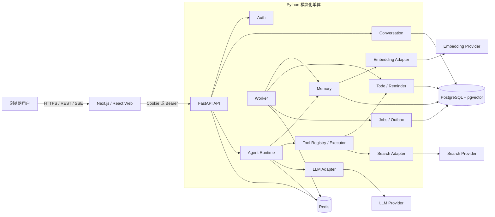
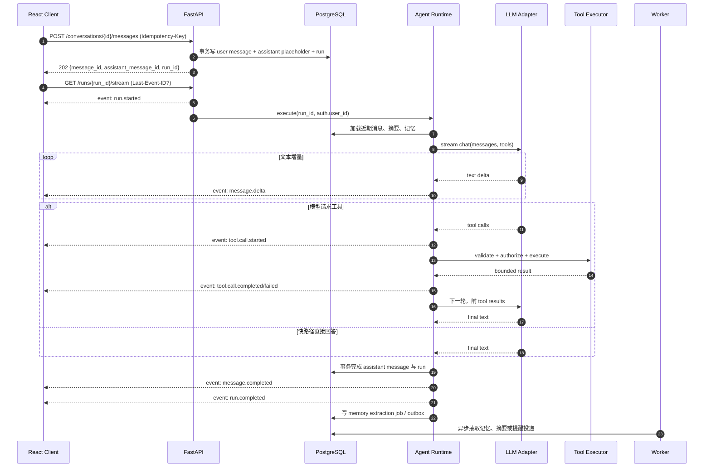
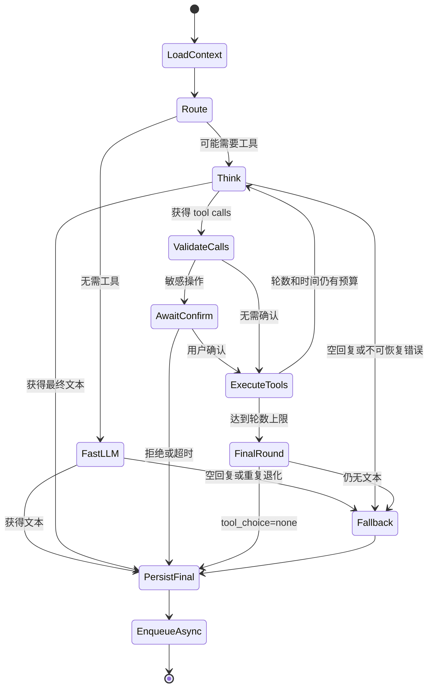
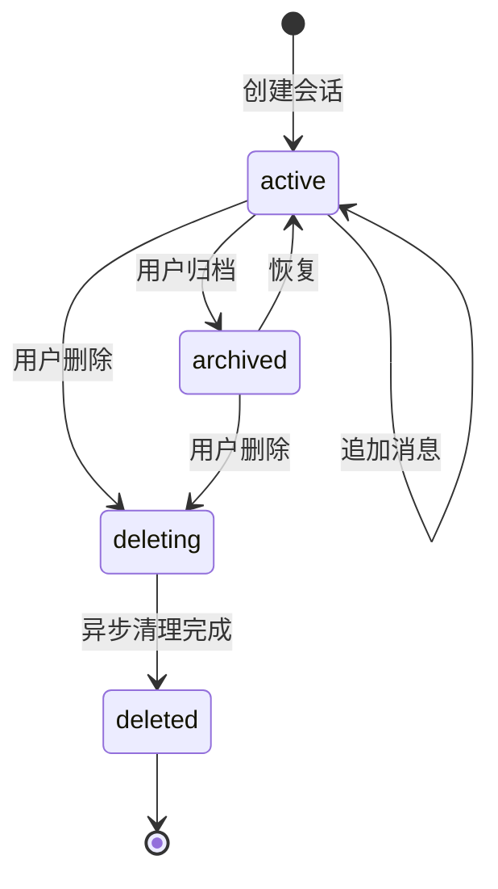
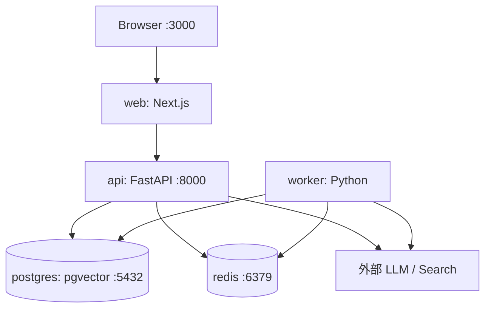

# 知伴技术架构设计

## 1. 文档定位

本文定义答辩项目"知伴"的可落地技术架构。知伴是类似豆包的通用个人 AI 助理，重点证明记忆、上下文、工具调用、流式交互和用户隔离能够组成一个稳定的端到端产品，而不是复刻企业级 Agent 平台。

设计输入：

- [课题说明](/Users/zzming/work/subject.md)
- 本地参考实现：[pcqq_agents](/Users/zzming/project/pcqq_agents)、[qmemory_runtime/strategies](/Users/zzming/project/qmemory_runtime/strategies)、[qq_agents_common](/Users/zzming/project/qq_agents_common)、[qagent_runtime](/Users/zzming/project/qagent_runtime)

以上仓库只用于理解事件流、工具重复检测、最后一轮收尾、记忆候选校验和 Outbox 等工程做法。知伴必须独立、轻量实现，不在源码或运行时直接依赖这些内部仓库。

## 2. 架构目标与原则

### 2.1 目标

1. 单用户操作有清晰反馈：首个 SSE 事件尽快返回，聊天过程可取消、可恢复查看。
2. Agent 行为有界：工具轮数、总时长、单工具时长、上下文 Token 都有硬上限。
3. 记忆失败不阻断聊天：主回答成功优先，记忆抽取异步、可追踪、可补偿。
4. 数据默认隔离：所有用户数据从认证主体派生 `user_id`，Repository 层强制作用域。
5. 依赖可替换：LLM、Embedding、Web Search 都通过适配器隔离供应商差异。
6. 一台开发机可运行：Docker Compose 启动 Web、API、Worker、PostgreSQL/pgvector、Redis。
7. 足够可观测：一次聊天可由 `request_id`、`trace_id`、`run_id`、`conversation_id` 串联。

### 2.2 原则

- **模块化单体优先**：一个 FastAPI 代码库内按领域分包，API 与 Worker 复用领域代码。
- **PostgreSQL 是事实源**：Redis 仅做缓存、限流、锁、短期状态和任务通知，不承载永久事实。
- **先确定性、后模型判断**：权限、Schema、TTL、幂等、重复检测由代码决定；LLM 只生成候选。
- **事件先于 UI 细节**：后端输出稳定的事件协议，前端根据事件渲染，不解析模型自然语言猜状态。
- **至少一次投递、幂等消费**：后台任务允许重复到达，但不能产生重复提醒或重复记忆。
- **安全失败**：敏感操作需要确认；搜索内容和工具结果均视为不可信数据。
- **不过度抽象**：只为当前 P0 能力提供稳定扩展点，不建设通用工作流编排平台。

## 3. 模块化单体边界

后端部署上只有 `api` 与 `worker` 两种进程，代码上保持以下边界：

| 模块 | 职责 | 不负责 |
|---|---|---|
| `auth` | 登录、会话、认证主体、权限上下文 | 业务对象查询 |
| `conversation` | 会话/消息持久化、标题、生命周期 | LLM 供应商协议 |
| `agent` | 有界循环、快路径、上下文组装、事件发布 | 具体工具业务 |
| `memory` | 候选生成、决策、持久化、检索、压缩前 flush | UI 展示 |
| `tools` | Registry、Executor、权限、超时、幂等、审计 | 决定业务对话策略 |
| `todo` / `reminder` | 待办、提醒规则、投递状态 | 通用任务队列实现 |
| `search` | Web Search 抽象、结果净化、引用 | 信任外部网页指令 |
| `llm` | Chat/Embedding 适配器、重试、熔断、Token 统计 | 业务编排 |
| `jobs` | 任务租约、重试、Outbox 投递 | 业务实体真相 |
| `observability` | 日志、指标、Trace、审计字段 | 保存敏感正文 |
| `repositories` | SQL、事务、强制用户作用域 | HTTP 与 Prompt |

模块间通过 Python 接口、领域对象和领域事件协作。禁止模块绕过 Repository 直接拼接无 `user_id` 的 SQL。

## 4. 总体拓扑



### 4.1 进程职责

- **Next.js**：认证页面、对话 UI、SSE 消费、工具状态、记忆与隐私设置。
- **FastAPI API**：认证、REST、SSE、事务边界、Agent 在线执行。
- **Worker**：记忆抽取/Embedding、摘要压缩、提醒调度、Outbox 投递、失败补偿。
- **PostgreSQL + pgvector**：关系数据、消息、向量、任务和审计的唯一事实源。
- **Redis**：限流计数、短租约锁、SSE 取消标记、短期缓存和后台任务通知队列；队列只携带可重建的 `job_id`，Redis 不可用时降级到 PostgreSQL 轮询。

## 5. 在线聊天链路

### 5.1 SSE 时序

客户端先用 REST 创建用户消息，再使用返回的 `run_id` 建立 SSE，避免断线重连导致消息重复创建。



### 5.2 SSE 协议要点

- `Content-Type: text/event-stream`，禁用代理缓冲，15 秒发送一次 `ping`。
- 每个事件包含递增 `seq`；SSE `id` 取 `{run_id}:{seq}`。
- 断线重连携带 `Last-Event-ID`。服务端可从短期事件缓存补发；缓存缺失时返回当前 run 快照。
- 客户端取消调用 `POST /runs/{run_id}/cancel`；服务端设置 Redis 取消标记并取消协程。
- `message.delta` 只是展示态；最终正文以数据库中的 `message.completed` 对应消息为准。
- 每个 run 只允许一个执行者，通过数据库状态条件更新或 Redis 短租约锁抢占。

## 6. Agent 有界循环

### 6.1 快路径与 Tool-use 路径

**快路径**适用于无需实时数据或副作用的请求，如闲聊、改写、解释当前上下文。它只执行一次 LLM 流式调用，不暴露工具或只暴露 `summary` 等纯函数工具。

**Tool-use 路径**适用于明确需要待办、提醒、当前时间、记忆管理或 Web Search 的请求。初版可用确定性规则做高精度路由；无法判定时进入带工具的 LLM 调用。路由误判应偏向快路径，模型仍可在下一轮明确请求工具。

### 6.2 状态机

默认最多 **4 个工具轮**，总超时默认 **60 秒**，均可配置。一个工具轮指"一次 LLM 产出一个或多个 tool call，并完成这些工具结果回填"；并行工具仍计为一个轮次，但单 run 工具调用总数另设上限 8。



### 6.3 终止条件

满足任一条件立即终止循环：

- 模型返回非空最终文本且没有工具调用；
- 达到 `max_tool_rounds=4`，进入一次 `tool_choice=none` 的 final round；
- 达到 `agent_total_timeout_seconds`；
- 用户取消；
- 连续两次出现相同 `tool_name + canonical_args`；
- 工具调用总数达到 8；
- 输出重复检测命中，或 LLM 连续两次空回复；
- 不可重试的认证、权限、参数或内容安全错误。

Final round 必须向模型注入"基于已有工具结果直接回答；信息不足时诚实说明"的系统后缀。若仍返回 tool call 或空文本，使用确定性 fallback，不再调用模型。

## 7. 统一事件模型

SSE、内部总线和审计共享核心字段，但只向前端暴露安全子集。

```json
{
  "event_id": "evt_01...",
  "seq": 12,
  "type": "tool.call.completed",
  "occurred_at": "2026-08-17T11:30:00.123Z",
  "request_id": "req_...",
  "trace_id": "tr_...",
  "run_id": "run_...",
  "conversation_id": "conv_...",
  "message_id": "msg_...",
  "data": {},
  "error": null
}
```

核心事件：

- `run.started`、`run.route.selected`、`run.completed`、`run.failed`、`run.cancelled`
- `message.started`、`message.delta`、`message.completed`
- `tool.call.started`、`tool.call.confirmation_required`、`tool.call.completed`、`tool.call.failed`
- `memory.flush.started`、`context.compacted`（通常仅调试模式或内部指标）
- `warning.degraded`、`error`
- `ping`

事件必须满足：同一 run 的 `seq` 单调递增；`run.completed/failed/cancelled` 三者互斥且只出现一次；工具开始与结束可由 `tool_call_id` 配对；错误事件不包含密钥、完整 Prompt 或敏感工具参数。

## 8. 会话生命周期



- 创建会话时生成 `conversation_id`，标题可在首轮完成后异步生成。
- 每轮用户消息和 assistant placeholder 同事务创建，保证 UI 可恢复。
- 同一会话默认串行执行 run，避免消息历史分叉；用户可取消前一 run 后继续。
- 超过上下文阈值时先 flush 记忆，再生成 rolling summary，旧消息仍保留于数据库但不再逐条进入 Prompt。
- 归档只影响列表展示；删除进入 `deleting`，撤销入口可保留短暂宽限期，最终软删并安排物理清除。
- 恢复 SSE 不重新执行 Agent，只恢复事件或读取 run/message 最终状态。

## 9. 错误、重试、降级与熔断

### 9.1 错误分类

| 类别 | 示例 | 是否重试 | 用户表现 |
|---|---|---:|---|
| `validation` | Pydantic 校验失败、非法状态 | 否 | 400/422，指出字段 |
| `auth` | 未登录、会话过期 | 否 | 401 |
| `permission` | 访问他人对象、工具未授权 | 否 | 403 或 404 |
| `conflict` | 幂等键冲突、run 已在执行 | 否 | 409 |
| `rate_limit` | 用户或供应商限流 | 按 `Retry-After` | 429，建议稍后重试 |
| `dependency_transient` | LLM 5xx、网络抖动 | 是 | 流内降级提示 |
| `tool_timeout` | 搜索或工具超时 | 可重试一次 | 继续用已有信息回答 |
| `model_invalid` | 非法 tool args、空回复 | 至多纠正一次 | fallback |
| `safety` | Prompt Injection、SSRF、敏感操作拒绝 | 否 | 安全提示 |
| `internal` | 未知异常 | 否或任务补偿 | 稳定错误文案 |

### 9.2 重试

- LLM 首字节前遇到网络错误、408、429、5xx：指数退避加抖动，默认最多 2 次；已向用户发送正文后不自动重放整轮，避免重复文本。
- 只读且幂等工具：超时/网络错误最多重试 1 次；写工具只有具备幂等键才可重试。
- Embedding、记忆抽取、摘要、Outbox：后台任务最多 5 次，退避 `1s, 5s, 30s, 2m, 10m`，之后进入 `dead`。
- 参数无效、权限拒绝、内容安全和 4xx（除 408/409/429）不重试。

### 9.3 降级

- Web Search 不可用：说明无法获取实时信息，基于已有知识回答，不伪造检索结果。
- Embedding 不可用：记忆检索退化为 lexical + recency；写入先保存正文，Embedding 后补。
- Redis 不可用：SSE 事件只保留当前连接，限流使用进程内保守值，Worker 使用 PostgreSQL 轮询。
- 记忆抽取失败：聊天正常完成，记录 `memory_job_failed` 并后台补偿。
- 主 LLM 不可用：在允许配置时切备用模型；没有备用模型则结束 run，不把依赖错误伪装成成功回答。

### 9.4 熔断

按 `provider + operation` 维护熔断器：

- 20 次滑动窗口内失败率大于 50%，且至少 10 次请求，打开 30 秒；
- 半开仅允许 2 个探测请求；
- 成功恢复关闭，失败再次打开并指数增加冷却时间，上限 5 分钟；
- 熔断状态只影响对应依赖，不阻断健康模块。

## 10. 可观测性

### 10.1 结构化日志字段

`timestamp`、`level`、`service`、`environment`、`version`、`request_id`、`trace_id`、`span_id`、`user_hash`、`conversation_id`、`message_id`、`run_id`、`job_id`、`tool_call_id`、`tool_name`、`provider`、`model`、`route`、`round`、`latency_ms`、`time_to_first_token_ms`、`input_tokens`、`output_tokens`、`memory_candidate_count`、`memory_retrieved_count`、`error_type`、`error_code`、`retry_count`、`degraded`。

日志中使用不可逆 `user_hash`，默认不记录消息正文、Prompt、Cookie、JWT、工具完整参数和搜索页面正文。

### 10.2 指标

- HTTP：请求量、p50/p95/p99、4xx/5xx、活跃 SSE、断线重连率。
- Agent：run 成功率、取消率、总时长、首 Token 时长、工具轮数分布、final-round 率、fallback 率。
- LLM：各模型 Token、成本估算、429/5xx、重试、熔断状态、空回复率、重复输出命中率。
- Tool：调用量、成功率、超时率、重复调用阻断率、确认接受/拒绝率、结果截断率。
- Memory：候选数、接受/拒绝原因、写入延迟、检索命中率、注入数、零结果率、用户删除率。
- Context：Prompt Token、summary Token、compaction 次数、flush 成功率、预算超限率。
- Worker：队列深度、最老任务年龄、重试数、dead job、提醒投递延迟、Outbox backlog。
- 数据库/Redis：连接池、慢查询、锁等待、缓存命中、Redis 错误率。

建议用 OpenTelemetry Trace 串联 `http -> agent -> llm/tool -> repository`，本地可用标准日志和 Prometheus 指标，答辩不强制引入完整监控平台。

## 11. 部署与本地 Docker Compose

### 11.1 本地拓扑



Compose 服务建议：

- `web`：Next.js，开发态热更新；
- `api`：Uvicorn，执行 Alembic migration 后启动；
- `worker`：与 API 使用同一 Python 镜像，不启动 HTTP；
- `postgres`：带 pgvector 扩展，持久化 volume；
- `redis`：开启 AOF 可选，但永久任务仍以 PostgreSQL 为准；
- 可选 `mailpit`：本地观察提醒邮件。

配置仅通过环境变量注入，如 `DATABASE_URL`、`REDIS_URL`、`LLM_PROVIDER`、`LLM_API_KEY`、`SEARCH_API_KEY`、`JWT_SECRET`。提交 `.env.example` 而不提交真实密钥。生产最小部署可将 Web、API、Worker 分成三个容器，数据库和 Redis 使用托管服务；API 多副本时 run 锁和任务租约必须生效。

## 12. 扩展点

- `LLMAdapter`：统一流式文本、tool calls、usage、错误映射。
- `EmbeddingAdapter`：统一向量维度和批量接口。
- `SearchAdapter`：统一查询、来源 URL、摘要、发布时间和安全净化。
- `Tool`：声明 Pydantic 输入、权限、超时、幂等和执行函数，注册即生效。
- `MemoryTypePolicy`：每类记忆的 TTL、冲突键、默认 importance、是否允许隐式写入。
- `EventSink`：SSE、日志、测试录制可订阅同一领域事件。
- `Notifier`：站内、邮件等提醒渠道。
- `Repository`：保持接口稳定，可替换测试内存实现，但生产只使用 PostgreSQL。

## 13. 明确非目标

本阶段不做：

- 企业级 DSL、可视化工作流编辑器、任意 DAG 编排和热加载脚本；
- 多 Agent 协商、Agent handoff、动态生成子 Agent；
- 第三方插件市场和运行任意用户代码；
- 企业组织、复杂 RBAC、租户计费、跨区域容灾；
- 自训练模型、全量知识库平台、多模态文件处理流水线；
- "永不出错"的事实承诺或完全自动执行高风险操作。

### 13.1 为什么不做企业级 DSL

知伴的核心流程固定为"加载上下文 → LLM → 可选工具 → 最终回答 → 异步记忆"。使用普通 Python 状态机更易调试、测试和答辩解释。DSL 会额外引入解析、版本、迁移、表达式安全和可视化调试成本，却不能提升本项目 P0 用户价值。稳定扩展点应放在 Tool、Adapter 和 Policy，而不是先抽象一门配置语言。

### 13.2 主 Agent - Subagent 架构（已引入，渐进式）

> 本节于 2026-08-20 更新：原「不做多 Agent」决策已反转，改为「主 Agent 负责路由 + 管理 ReAct 生命周期，subagent 干具体事务」的职责分离架构。

**设计原则**：
- 主 Agent（Orchestrator）只负责**路由 + 管理 ReAct 生命周期**，不直接执行专业领域事务。
- Subagent 干具体的事，返回**结构化摘要**（summary + data），不把内部推理透传给主 Agent。
- 路由决策由主 Agent 通过一次 LLM 调用在 ReAct 中动态完成（`target: memory | general | none`），代码不硬编码路由。
- Subagent 数量精简，按领域职责划分，而非「每个工具一个 subagent」。

**当前 Subagent 清单**（2026-08-20 现状）：

| Subagent | 职责 | 拥有的工具 | 状态 |
|---|---|---|---|
| `MemoryAgent`（memory） | 记忆召回 + 增删改查 | memory.list/add/update/delete | ✅ 已实现 |
| `TaskAgent`（task） | 待办 + 提醒 | todo.create/complete、reminder.create/cancel | ✅ 已实现 |
| `SearchAgent`（search） | 联网检索 + 引用 | web_search | ✅ 已实现 |
| `general`（通用兜底） | 闲聊/解释/改写 | 无工具（主 Agent 直接回答） | ✅ 由主 Agent 兜底 |

**工具归属划分**：
- 主 Agent 仅保留轻量只读工具：`current_time`、`summary`（纯函数、无副作用、无需独立 subagent）。
- 有写副作用或独立治理逻辑的工具归 subagent：memory 工具 → MemoryAgent、todo/reminder 工具 → TaskAgent、web_search → SearchAgent。
- `general` 不设独立 subagent，直接走主 Agent 的无工具回答路径（避免「每个请求都套一个 subagent」的过度拆分）。

**为什么要职责分离**：
- 记忆是产品核心差异化能力，且有独立的召回/冲突决策/治理逻辑，值得独立成 subagent。
- 主 Agent 的上下文不再被记忆操作的工具调用细节污染；subagent 返回结构化摘要，主 Agent 基于摘要生成最终回答。
- 每个 subagent 可独立演进、独立测试、独立治理，符合「不过度抽象」前提下的合理拆分。

**为什么不是更激进的多 Agent**：
- 仍不引入任意 DAG 编排、Agent 间协商、动态生成子 Agent（这些仍是非目标）。
- 主 Agent - Subagent 是「单层委派」，不是「多 Agent 协商」，避免了上下文复制、事件归属、死循环等复杂问题。

## 14. 架构验收标准

1. Docker Compose 可在空环境完成建库并启动全部核心服务。
2. 普通聊天通过快路径流式返回；待办或搜索请求可看到工具开始、结束和最终回答。
3. 相同消息幂等重试不产生第二条用户消息或第二个副作用。
4. 工具循环最多 4 轮，最终轮禁用工具；空回复和重复输出有确定性兜底。
5. Redis、Embedding、Memory Worker 任一故障不应破坏已建立的基础聊天能力。
6. 任意业务查询都能证明用户作用域来自认证主体，并通过跨用户自动化测试。
7. 一次失败 run 可用 `trace_id/run_id` 定位到 LLM、工具、数据库或 Worker 阶段。
