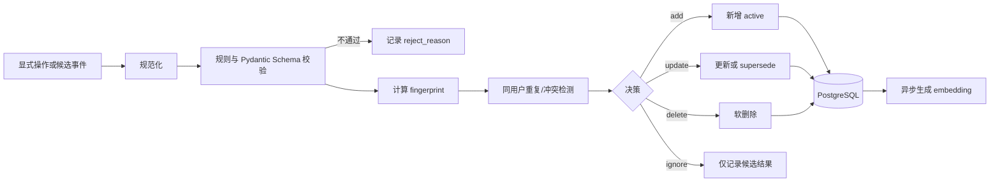

# 知伴记忆、上下文与工具设计

## 1. 目标与边界

本文给出可直接指导 Python/FastAPI 实现的记忆、上下文和 Tool Use 方案。核心约束是：

- LLM 只提出“候选”，确定性代码负责校验、权限、冲突、幂等和持久化。
- 记忆异步写入，失败不能阻断当前聊天。
- 检索先按认证用户做硬过滤，再做混合召回和可解释排序。
- 上下文有 Token 硬预算；达到阈值时先 flush 记忆，再压缩历史。
- 工具调用有界、可审计、可去重；敏感副作用必须确认。

参考 [课题说明](/Users/zzming/work/subject.md) 和本地四仓中的工程思路，但知伴独立实现，不导入其代码或私有依赖。

## 2. 统一术语

- **记忆候选（MemoryCandidate）**：从用户显式操作或对话中提取、尚未成为有效记忆的结构化事实。
- **记忆（Memory）**：通过校验与决策、属于单个用户、可被检索和管理的事实。
- **来源证据（Evidence）**：支持候选的消息 ID 和短引用，不保存模型虚构的依据。
- **显式记忆**：用户明确说“记住……”或在记忆管理界面新增/修改。
- **隐式记忆**：系统从自然对话中推断出的长期稳定信息。
- **flush**：在压缩消息前抽取尚未处理的长期记忆。
- **compaction**：把较旧消息压缩为 rolling summary。
- **工具轮（Tool round）**：一次 LLM 产生 tool calls，执行后把结果送回 LLM 的完整循环。

## 3. 记忆分类、来源、状态与 TTL

### 3.1 分类

| `memory_type` | 含义 | 示例 | 默认 TTL | 隐式写入 |
|---|---|---|---:|---|
| `identity` | 稳定身份事实 | “我是前端工程师” | 永久 | 高置信可写 |
| `preference` | 偏好与厌恶 | “回答尽量简洁” | 365 天 | 可写 |
| `habit` | 重复行为/习惯 | “工作日早上跑步” | 180 天 | 需较高置信 |
| `person` | 与用户相关的人物 | “小林是我的同事” | 365 天 | 可写 |
| `event` | 对未来对话有价值的事件 | “九月要去杭州参会” | 事件后 30 天 | 可写 |
| `task` | 可跟踪事项的记忆投影 | “准备毕业答辩” | 完成后 30 天 | 优先转 Todo |
| `temporary` | 短期上下文 | “这周住在上海” | 7 天 | 可写 |
| `communication` | 交互规则 | “不要使用 emoji” | 永久 | 高置信可写 |

`todo` 与 `reminder` 是独立业务实体，不只是一条记忆。模型识别到明确待办/提醒时，应调用工具创建实体；可选地生成 `task` 记忆投影，但不得以记忆替代任务状态。

### 3.2 显式与隐式策略

- 显式候选：`source_kind=explicit`，默认 `confidence=1.0`，仍需 Schema、安全和冲突校验。
- 隐式候选：`source_kind=implicit`，要求直接用户证据；不能把 assistant 自己说的话写成用户记忆。
- 健康、财务、精确位置、证件、账号、密码等敏感信息默认不做隐式长期记忆；显式请求也应提示并按隐私策略处理。
- 模糊推断、一次性情绪、第三方未经必要化的信息应忽略。

### 3.3 状态

候选状态：

```text
pending -> processing -> accepted
                      -> rejected
                      -> failed_retryable -> processing
                      -> dead
```

记忆状态：

```text
active -> superseded
active -> deleted
active -> expired
superseded/deleted/expired -> purged
```

- `superseded`：被新事实替代，保留审计关联，不参与默认检索。
- `deleted`：用户删除或隐私删除，立即停止检索，之后物理清除。
- `expired`：`expires_at <= now()`；查询时必须排除，Worker 可批量标记。
- TTL 以类型默认值为基础，候选可提供合理的 `valid_until`；`expires_at` 取更保守值。

## 4. 记忆写入流水线

### 4.1 总流程



聊天完成后，在同一事务写入 `memory.extract.requested` Outbox 或 Job。Worker 消费时：

1. 读取该用户本轮新增的 user/assistant 消息，但抽取证据仅允许 user 消息。
2. LLM 以严格 JSON Schema 返回候选数组，不直接执行 SQL。
3. Pydantic 校验字段和枚举；规则校验长度、来源、敏感性、时间。
4. 计算确定性 fingerprint，查询同用户同作用域已有记忆。
5. 执行重复和冲突检测，得到 `add/update/delete/ignore`。
6. 在数据库事务中更新候选、记忆和 Outbox；提交后异步 Embedding。
7. 任一步失败只更新任务状态和指标，不能把已完成聊天改为失败。

### 4.2 候选 Schema

```python
class MemoryCandidatePayload(BaseModel):
    memory_type: Literal[
        "identity", "preference", "habit", "person",
        "event", "task", "temporary", "communication"
    ]
    subject: str = Field(min_length=1, max_length=80)
    predicate: str = Field(min_length=1, max_length=80)
    value: str = Field(min_length=1, max_length=500)
    source_message_ids: list[UUID] = Field(min_length=1, max_length=8)
    evidence_quote: str = Field(min_length=1, max_length=240)
    confidence: float = Field(ge=0, le=1)
    importance: float = Field(ge=0, le=1)
    valid_until: datetime | None = None
```

规则补充：

- `source_message_ids` 必须属于同一 `user_id` 且在本次允许批次内。
- `evidence_quote` 必须可在对应 user message 规范化文本中找到；找不到则拒绝。
- `subject` 默认是 `self`；涉及第三方时只保留完成用户目标所必需的最少信息。
- 文本去除首尾空白、Unicode NFKC、连续空白折叠；不做会改变语义的同义改写。
- `confidence < 0.65` 的隐式候选直接忽略；`habit` 的隐式候选默认要求 `>=0.8` 或多次独立证据。

### 4.3 确定性 fingerprint 与幂等

```text
canonical_key =
  user_id + "\x1f" +
  memory_type + "\x1f" +
  normalize(subject) + "\x1f" +
  normalize(predicate) + "\x1f" +
  normalize(value)

fingerprint = SHA-256(canonical_key)
```

- 数据库唯一约束：`UNIQUE(user_id, fingerprint) WHERE status='active'`。
- 候选幂等键：`SHA-256(user_id + extractor_version + sorted(source_message_ids) + canonical_candidate)`。
- 相同候选重复消费时返回已有决策，不重复写入。
- 对 `preference/identity/communication`，另算不含 `value` 的 `conflict_key`，用于发现“同一槽位值变化”。
- 模型、Prompt 或 extractor 版本写入候选，便于重放；版本不能参与 active 记忆 fingerprint，否则升级会重复写入。

### 4.4 重复、冲突与动作

按以下顺序决策：

1. **精确重复**：同 `fingerprint` active 记忆存在，`ignore`；只增加 `last_evidenced_at` 和证据计数。
2. **近重复**：同类型、同 conflict key，规范化值相同或文本相似度 `>=0.92`，`update` 证据和置信度，不新建。
3. **明确否定/删除**：显式“忘记/删除 X”，在对象级鉴权后 `delete`。
4. **槽位冲突**：如“喜欢深色”变为“更喜欢浅色”，新建或更新新值，并把旧记忆 `superseded_by_id` 指向新记忆。
5. **时间事件冲突**：相同事件主体和谓词但日期变更，优先最新的显式证据。
6. **无冲突**：`add`。
7. **不值得长期保存**：`ignore`。

冲突检测不得跨用户；向量相似只用于候选提示，不能单独决定删除或覆盖。

### 4.5 `reject_reason`

固定枚举，便于监控和测试：

- `schema_invalid`
- `unknown_type`
- `empty_value`
- `value_too_long`
- `source_missing`
- `source_out_of_scope`
- `evidence_not_found`
- `assistant_only_evidence`
- `confidence_too_low`
- `sensitive_implicit_memory`
- `ephemeral_not_useful`
- `unsupported_third_party_data`
- `expired_on_arrival`
- `duplicate`
- `conflict_ambiguous`
- `user_disabled_memory`
- `policy_blocked`
- `persistence_failed`

`duplicate` 可作为 `decision=ignore` 的原因而非真正错误。原始异常保存为内部错误码和截断摘要，不向模型暴露数据库细节。

## 5. 记忆数据字段与状态转换

核心 `memories` 字段：

| 字段 | 说明 |
|---|---|
| `id`, `user_id` | UUID 主键与强制用户作用域 |
| `memory_type` | 固定枚举 |
| `subject`, `predicate`, `value` | 结构化事实 |
| `content` | 面向检索/展示的确定性渲染文本 |
| `source_kind` | `explicit/implicit/imported` |
| `status` | `active/superseded/deleted/expired` |
| `confidence`, `importance` | 0 到 1 |
| `fingerprint`, `conflict_key` | 去重与冲突键 |
| `embedding` | pgvector，可空 |
| `source_message_ids` | UUID 数组或关联表 |
| `evidence_quote` | 最短必要证据 |
| `valid_from`, `expires_at` | 有效时间 |
| `last_evidenced_at`, `last_retrieved_at` | 证据与使用时间 |
| `retrieval_count` | 使用次数，只作弱信号 |
| `superseded_by_id` | 新记忆引用 |
| `created_at`, `updated_at`, `deleted_at` | UTC 时间 |
| `version` | 乐观锁版本 |

状态转换规则：

- 只有 `active` 可进入检索。
- `active -> superseded/deleted/expired` 合法，反向恢复必须创建审计事件。
- 更新正文时重新计算 fingerprint、清空旧 embedding 并创建 embedding job。
- `deleted` 立即从所有缓存移除；物理清理按保留策略执行。
- Worker 的过期扫描是补偿机制，在线 SQL 仍必须使用 `expires_at IS NULL OR expires_at > now()`。

## 6. 混合检索与防误注入

### 6.1 硬过滤

检索 SQL 的第一层必须是：

```text
user_id = auth.user_id
AND status = 'active'
AND deleted_at IS NULL
AND (expires_at IS NULL OR expires_at > now())
```

再根据查询意图限制类型。例如询问“我偏好什么”可提高 `preference/communication` 权重；当前日期相关问题允许 `event/temporary/task`。严禁先做全库向量搜索再在应用层过滤用户。

### 6.2 召回与默认参数

1. PostgreSQL `tsvector` lexical 召回 Top 20。
2. pgvector cosine 召回 Top 20，向量相似度低于 0.55 的不进入合并集。
3. 合并去重后最多保留 **30 个候选**。
4. 可解释重排后默认返回 **6 条**，硬上限 10。
5. 注入记忆默认 **800 tokens**，硬上限 1200；超限按分数逐条截断，不截断单条事实中间。

Embedding 不可用时使用 lexical + recency，不应返回未过滤的低相关记忆。

### 6.3 可解释评分

所有分量归一化到 `[0,1]`：

```text
lexical   = normalized_ts_rank
vector    = max(0, cosine_similarity)
recency   = exp(-age_days / half_life_days[type])
importance= stored_importance
confidence= stored_confidence
type_match= 1.0（意图匹配）/ 0.5（中性）/ 0（冲突）

score =
  0.30 * vector +
  0.25 * lexical +
  0.15 * recency +
  0.12 * importance +
  0.10 * confidence +
  0.08 * type_match
```

默认半衰期：`temporary=3` 天、`event=30`、`task=30`、`habit=90`、`preference/person=180`、`identity/communication=365`。永久不等于永远高相关，仍受查询相关性约束。

### 6.4 注入门槛

记忆仅在以下条件同时满足时注入：

- `score >= 0.62`；
- `max(vector, lexical) >= 0.45`；
- 与当前问题存在可描述的关键词、语义或类型关联；
- 未与当前 user message 的明确陈述冲突；
- 通过 TTL、状态、用户作用域和敏感性过滤。

若分数处于 `0.55~0.62`，只可作为候选用于澄清，不应当成事实注入。当前消息说“这次不要按我平时偏好”时，当前指令优先。Prompt 中将记忆标为“可能有帮助的用户资料”，要求模型不相关时忽略、冲突时以当前用户陈述为准。

每个检索结果保留 `score_breakdown` 和 `selected_reason`，但不直接展示内部向量值给普通用户。

## 7. 上下文组装与 Token 预算

### 7.1 固定顺序

```text
1. system：身份、安全、工具与输出规则
2. rolling summary：被压缩的历史摘要
3. retrieved memories：本轮相关记忆
4. recent window：近期原始 user/assistant/tool 消息
5. current user：当前用户消息，始终保留
6. current-run tool results：按 tool_call_id 成对附加
```

逻辑顺序强调 system 最高优先级和 current user 最新；具体供应商若要求 tool call/result 紧邻，序列化适配器必须维持协议配对。

### 7.2 默认预算

以模型上下文窗口 `context_window=32768` 为例：

| 部分 | 默认预算 |
|---|---:|
| 输出预留 | 4096 |
| 工具 Schema | 3000 |
| System | 2200 |
| Rolling summary | 1800 |
| Retrieved memories | 800 |
| Recent window | 16000 |
| Current user | 2000 |
| Tool results | 2200 |
| 安全余量 | 672 |

实际预算由 tokenizer 精确计算，不用 `字符数/4` 作为最终判断。Current user 超限时返回输入过长错误或先要求用户缩短，不能静默丢弃尾部。

### 7.3 两级阈值

- **软阈值 70%**：当前 Prompt 预计超过可用输入的 70% 时，调度 `memory flush`，折叠旧 tool results，并尝试生成增量 rolling summary。
- **硬阈值 85%**：进入 LLM 前仍超过 85% 时，必须同步执行“先 flush、后 compaction”，直到低于目标 65%；若 flush 失败仍继续 compaction，并记录降级。
- 绝不压缩 current user、待确认工具调用、未成对 tool result、最近 4 个完整对话 turn。

### 7.4 memory flush 与 compaction

flush 的输入范围是“上次 `memory_flushed_through_message_id` 之后、即将被压缩的 user 消息”。成功或确定性无候选后推进游标；暂时失败不推进，避免永久漏抽取。

rolling summary 不是自由发挥，应使用结构：

```yaml
goals: []
decisions: []
open_questions: []
constraints: []
referenced_entities: []
tool_facts:
  - fact: ""
    source_tool_call_id: ""
```

新摘要由“旧摘要 + 本次待压缩消息”生成，记录覆盖的消息区间、模型版本和 Token 数。摘要不能成为长期记忆的唯一证据。

### 7.5 工具结果折叠

- 当前工具轮保留完整但有长度预算的结果。
- 一轮之后把工具结果折叠为 200 tokens 内的结构化摘要，保留 `tool_name`、关键事实、来源 URL、错误码。
- 原始结果持久化在 `tool_calls.result_json/result_blob_ref`，不反复注入 Prompt。
- 搜索结果最多保留 5 个来源，每来源摘要默认 500 字符；HTML、脚本和页面指令全部剥离。
- 任何折叠都必须保持 tool call 与 tool result 协议配对。

## 8. Tool Registry 与 Executor

### 8.1 工具声明

```python
class ToolSpec(BaseModel):
    name: str
    description: str
    input_model: type[BaseModel]
    permission: Literal["read", "write", "sensitive"]
    timeout_seconds: float = 10
    idempotency: Literal["none", "optional", "required"]
    retry_policy: Literal["never", "safe_once"]
    result_token_budget: int = 600

class Tool(Protocol):
    spec: ToolSpec
    async def execute(self, ctx: ToolContext, args: BaseModel) -> ToolResult: ...
```

Registry 在应用启动时注册并拒绝重名。向 LLM 暴露的 JSON Schema 由 Pydantic 自动生成，`additionalProperties=false`。模型返回参数必须再次用对应 Pydantic Model 校验，不能把原始 JSON 直接传给业务函数。

### 8.2 权限级别

- `read`：读当前用户数据、当前时间、Web Search；可直接执行。
- `write`：创建/修改用户自己的 Todo、Reminder、Memory；需要明确用户意图，但一般不弹二次确认。
- `sensitive`：批量删除、外部发送、导出敏感数据、覆盖大量记录；必须生成确认请求，确认 Token 绑定 `user_id + tool_name + canonical_args_hash + expires_at`。

工具不能接受可信 `user_id` 参数。`ToolContext.user_id` 来自认证主体，LLM 参数中的同名字段应拒绝或忽略。

### 8.3 超时、幂等、重复与重试

- 每个工具 `asyncio.timeout(spec.timeout_seconds)`；run 还受总超时控制。
- 写工具构造 `operation_key = SHA-256(user_id + run_id + tool_name + canonical_args)`，数据库唯一约束保证重试不重复副作用。
- 同一 run 内相同 `tool_name + canonical_args`：
  - 第一次正常执行；
  - 再次出现时返回缓存结果，不执行；
  - 连续第二轮仍请求同一调用，标记 `tool_repetition` 并进入 final round。
- 只读、无副作用且声明 `safe_once` 的工具可对网络超时/5xx重试一次。
- 写工具仅在幂等键已落库且错误发生在结果未知阶段时重试；参数、权限、4xx 不重试。

### 8.4 工具结果预算与调用记录

工具返回统一结构：

```python
class ToolResult(BaseModel):
    ok: bool
    data: dict | list | None = None
    summary: str
    error_code: str | None = None
    retryable: bool = False
    citations: list[str] = []
    truncated: bool = False
```

Executor 在注入模型前按 `result_token_budget` 截断/摘要，原始结果可存数据库或对象存储引用。`tool_calls` 至少记录：

- `id/user_id/run_id/round/tool_name`
- `arguments_json/arguments_hash`
- `permission_level/confirmation_status`
- `idempotency_key/status`
- `started_at/finished_at/duration_ms`
- `result_json/result_truncated`
- `error_code/retry_count`
- `provider_request_id/created_at`

参数和结果日志按工具字段级脱敏，数据库中的敏感结果也应最小化保存。

### 8.5 P0 内置工具

| 工具 | 权限 | 默认超时 | 幂等 |
|---|---|---:|---|
| `todo.create/get/list/update/delete` | read/write | 5s | 写操作 required |
| `reminder.create/list/update/cancel` | read/write | 5s | 写操作 required |
| `web.search` | read | 12s | optional，可缓存 |
| `summary.create` | read | 20s | optional |
| `memory.add/list/update/delete` | read/write | 5s | 写操作 required |
| `current_time.get` | read | 1s | optional |

`todo.delete` 和单条 `memory.delete` 可视为普通 write；批量删除或全部清空升级为 sensitive。`current_time.get` 接受 IANA 时区，默认用户设置时区，不由模型自行假设。

## 9. Agent 有界循环与兜底

### 9.1 伪代码

```python
async def run_agent(ctx: RunContext) -> FinalAnswer:
    deadline = monotonic() + settings.agent_total_timeout_seconds
    context = await build_context(ctx)
    history: list[str] = []
    empty_count = 0

    for round_no in range(1, settings.max_tool_rounds + 1):
        ensure_before(deadline)
        response = await llm.chat_stream(
            messages=context.messages,
            tools=registry.schemas(ctx.allowed_tools),
            tool_choice="auto",
        )

        if response.text.strip() and not response.tool_calls:
            return persist_final(ctx, response.text)

        if not response.tool_calls:
            empty_count += 1
            if empty_count >= 2:
                return persist_final(ctx, deterministic_empty_fallback())
            context.add_system("上一轮没有有效输出，请直接回答用户。")
            continue

        signatures = [
            signature(c.name, canonical_json(c.arguments))
            for c in response.tool_calls
        ]
        if any(sig in history for sig in signatures):
            context.add_tool_error("检测到重复工具调用，请基于已有结果作答。")
            break

        results = await executor.execute_bounded(ctx, response.tool_calls)
        history.extend(signatures)
        context.add_tool_exchange(response.tool_calls, results)

    # 最后一轮不再提供工具
    final = await llm.chat_stream(
        messages=context.with_final_round_hint(),
        tools=[],
        tool_choice="none",
    )
    text = final.text.strip()
    if not text or final.tool_calls or repeated_output(text):
        text = deterministic_limit_fallback(context.tool_summaries)
    return persist_final(ctx, text)
```

### 9.2 空回复和重复输出

- 空回复第一次：同一轮上下文追加短纠正提示后重试一次。
- 连续第二次为空：使用固定 fallback，说明未能生成有效回复并建议重试。
- 流式文本维护最近 512 字符窗口；连续重复片段达到 4 次时停止上游流，记录 `output_repetition`。
- 最终文本若与当前 run 已发送文本高度重复，不重复拼接；以已发送有效部分收尾。
- fallback 不应声称工具执行成功，只能引用已确认成功的 `ToolResult.summary`。

## 10. 配置草案

```yaml
agent:
  total_timeout_seconds: 60
  max_tool_rounds: 4
  max_tool_calls_per_run: 8
  final_round_timeout_seconds: 15
  empty_response_retries: 1
  repeated_call_limit: 2

context:
  model_context_window: 32768
  output_reserve_tokens: 4096
  soft_threshold_ratio: 0.70
  hard_threshold_ratio: 0.85
  compact_target_ratio: 0.65
  keep_recent_turns: 4
  summary_budget_tokens: 1800
  memories_budget_tokens: 800
  tool_results_budget_tokens: 2200

memory:
  extraction_async: true
  candidate_batch_size: 20
  implicit_min_confidence: 0.65
  habit_min_confidence: 0.80
  retrieval:
    lexical_candidates: 20
    vector_candidates: 20
    merged_candidates: 30
    return_count: 6
    max_return_count: 10
    min_vector_similarity: 0.55
    min_final_score: 0.62
    token_budget: 800
  ttl_days:
    preference: 365
    habit: 180
    person: 365
    event_after_end: 30
    task_after_done: 30
    temporary: 7

tools:
  default_timeout_seconds: 10
  default_result_token_budget: 600
  safe_retry_count: 1
  confirmation_ttl_seconds: 300
```

配置启动时由 Pydantic Settings 校验：比例满足 `soft < hard`、`compact_target < soft`；轮数和预算必须为正；Embedding 维度必须和数据库列一致。

## 11. 验收不变量

### 11.1 记忆

1. 任何 active 记忆都能追溯到同用户证据或显式用户操作。
2. 同一 `user_id + fingerprint` 最多一条 active 记忆。
3. assistant-only 文本永远不能成为隐式记忆证据。
4. deleted、expired、superseded 记忆永远不进入默认检索。
5. 记忆检索的 SQL 必须在向量排序前包含 `user_id` 硬过滤。
6. 同一候选重复消费不会创建第二条记忆。
7. 记忆抽取、Embedding 或持久化失败不改变聊天 run 的成功状态。

### 11.2 上下文

1. system 和 current user 永远不被 compaction 丢弃。
2. 硬阈值下先尝试 memory flush，再压缩历史。
3. tool call 与 tool result 始终成对且 ID 一致。
4. 发送给模型的输入 Token 加输出预留不超过模型窗口。
5. rolling summary 有覆盖区间，不能被当作长期记忆唯一证据。

### 11.3 工具

1. 模型参数必须经过对应 Pydantic Schema。
2. `user_id` 只取认证 ToolContext，永不信任模型参数。
3. 写工具在可重试前必须具备持久化幂等键。
4. 相同调用不会在同一 run 产生第二次副作用。
5. sensitive 工具未确认时不执行。
6. 最多 4 个工具轮，final round 固定 `tool_choice=none`。
7. 每个工具调用都有开始、终态、耗时和错误码记录。

## 12. 可观测指标

- `memory_candidates_total{type,source,decision,reject_reason}`
- `memory_extraction_duration_ms`、`memory_extraction_failures_total`
- `memory_fingerprint_conflicts_total`、`memory_superseded_total`
- `memory_retrieval_candidates`、`memory_retrieval_selected`
- `memory_retrieval_score{component}`、`memory_injection_tokens`
- `memory_irrelevant_feedback_total`、`memory_delete_total`
- `context_input_tokens`、`context_budget_ratio`
- `context_memory_flush_total{result}`、`context_compaction_total{result}`
- `context_summary_tokens`、`tool_result_truncated_total`
- `agent_tool_rounds`、`agent_final_round_total`
- `tool_calls_total{tool,status}`、`tool_duration_ms{tool}`
- `tool_timeout_total`、`tool_retry_total`
- `tool_duplicate_cache_hit_total`、`tool_repetition_block_total`
- `tool_confirmation_total{tool,result}`
- `llm_empty_response_total`、`llm_output_repetition_total`

日志关联字段至少包括 `trace_id`、`run_id`、`conversation_id`、`user_hash`、`candidate_id`、`memory_id`、`tool_call_id`、`round` 和 `extractor_version`。普通日志不记录完整记忆正文、Prompt 或敏感参数。
