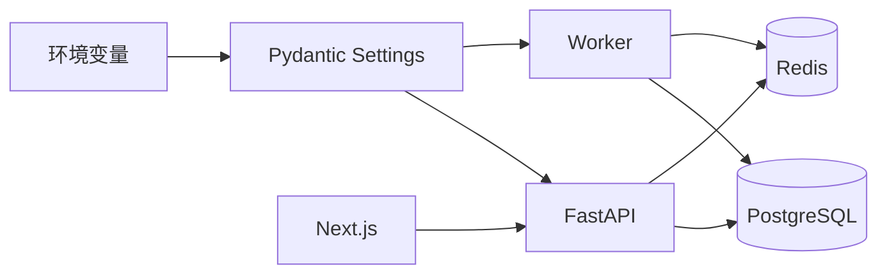

# SPEC-001：工程基础与质量门禁

## 1. 元数据

| 字段 | 值 |
|---|---|
| Spec ID | `SPEC-001` |
| 状态 | `partial` |
| 版本 | `1.0.0` |
| 创建日期 | 2026-08-17 |
| 最后更新 | 2026-08-17 |
| 实施阶段 | `06-implementation-plan.md` 阶段 1 |
| 前置依赖 | 无 |
| 后续依赖 | `SPEC-002` 及后续业务 Spec |

来源：

- [产品需求](../../docs/01-product-requirements.md)：`NFR-005/007~009/011/013/014`、`AC-066/067`、`PRD SEC-002/007`。
- [技术架构](../../docs/03-technical-architecture.md)。
- [API、数据与安全设计](../../docs/05-api-data-security-design.md)。
- [实施计划](../../docs/06-implementation-plan.md)阶段 1。
- [测试计划](../../docs/07-test-plan.md)：`UT-001~010`、`IT-001~010`、`API-001~005`、`DR-001`。

## 2. 背景与问题

当前工作区已有完整方案文档，但没有业务工程、依赖锁定、统一命令、环境配置、健康检查或 CI。若直接开发聊天、记忆和工具，会产生以下风险：

- Web、API、Worker 使用不同目录和命令，后续难以复现。
- Node/Python 依赖和版本未锁定，答辩机器可能无法启动。
- 配置与密钥边界未建立，容易把真实凭据提交到仓库或前端。
- 数据库迁移、OpenAPI、类型检查和测试缺少统一门禁。
- 后续 Spec 无稳定工程落点。

本 Spec 建立后续所有业务实现共同依赖的最小工程基础。

## 3. 目标

1. 建立可理解的 monorepo 目录和统一开发命令。
2. 初始化 Next.js Web、FastAPI API 和 Python Worker 的最小可运行骨架。
3. 建立 PostgreSQL/pgvector、Redis 和迁移基础。
4. 建立类型化配置、统一错误、请求标识、结构化日志和健康检查。
5. 建立格式化、Lint、类型、单元测试、迁移和构建门禁。
6. 提供不含真实密钥的环境示例与可复现运行说明。

## 4. 非目标

本步骤不实现：

- 注册、登录和用户会话。
- 聊天、SSE、LLM 或 Agent。
- 记忆、工具、待办和提醒业务。
- 完整 PostgreSQL 业务表；只建立迁移框架和必要探针。
- 生产集群、Kubernetes、云资源或完整监控平台。
- 企业级 DSL、多 Agent、QQ 内部依赖。

## 5. 已知环境

2026-08-17 实际探测结果：

| 工具 | 状态 |
|---|---|
| Node.js | 已安装：`v24.14.1` |
| Corepack | 已安装：`0.34.6` |
| pnpm | Corepack 管理：`11.22.0` |
| 系统 Python | `3.9.6`，不满足目标版本 |
| 项目 Python / uv | `3.12.13` / `0.11.11` |
| Docker CLI / daemon | `29.7.2` / `29.5.2 linux/arm64` |
| Compose / Buildx | `5.4.0` / `0.36.1` |
| Colima | `0.10.3`，Virtualization.Framework |

实现决策：

- Web MUST 使用 Corepack 管理并在根 `package.json#packageManager` 锁定 pnpm 版本。
- API MUST 使用 uv 管理 Python `3.12`，不得依赖系统 Python 3.9。
- MUST 提交并实际验证 Docker Compose；本机使用 Colima 提供 arm64 Docker daemon。
- 宿主机开发与完整容器模式 MUST 共用同一 migration、readiness 和 Smoke 契约。

## 6. 目标目录契约

```text
work/
├── apps/
│   ├── web/
│   │   ├── app/
│   │   ├── components/
│   │   ├── features/
│   │   ├── lib/
│   │   └── tests/
│   └── api/
│       ├── src/zhiban/
│       │   ├── api/
│       │   ├── core/
│       │   ├── db/
│       │   ├── observability/
│       │   └── workers/
│       ├── migrations/
│       └── tests/
├── packages/
│   └── contracts/
├── infra/
│   ├── compose/
│   └── docker/
├── fixtures/
├── scripts/
├── specs/
├── docs/
├── .env.example
├── .gitignore
├── package.json
├── pnpm-workspace.yaml
├── pyproject.toml
└── Makefile
```

目录 MAY 在实现中补充，但禁止把业务代码放回 `docs/`、`scripts/` 或仓库根目录。

## 7. 规范要求

### 7.1 工具链与依赖

- **SPEC-FND-001** 根目录 MUST 使用 pnpm workspace 管理 Web 与共享 TypeScript 包。
- **SPEC-FND-002** 根 `package.json` MUST 锁定 `packageManager`，并提供 `dev/build/lint/typecheck/test` 聚合脚本。
- **SPEC-FND-003** Python MUST 使用 `uv`、`pyproject.toml` 和 lockfile，目标版本为 Python 3.12。
- **SPEC-FND-004** Python 生产依赖与开发依赖 MUST 分组；不得依赖开发工具才能启动 API。
- **SPEC-FND-005** 依赖版本 MUST 来自包管理器实际解析和锁文件，不手写不存在的版本。

### 7.2 Web 骨架

- **SPEC-FND-010** Web MUST 使用 Next.js、React、TypeScript strict mode 和 App Router。
- **SPEC-FND-011** Web MUST 提供可访问的基础首页或占位页，并明确当前为工程初始化状态。
- **SPEC-FND-012** 浏览器 bundle MUST NOT 包含数据库、模型或服务端签名密钥。
- **SPEC-FND-013** Web MUST 通过环境变量获取公开 API 基址；只有 `NEXT_PUBLIC_` 前缀配置可以进入浏览器。

### 7.3 API 与 Worker 骨架

- **SPEC-FND-020** API MUST 使用 FastAPI 和 `src/zhiban` 布局，禁止依赖当前工作目录的隐式 import。
- **SPEC-FND-021** API MUST 提供 `/api/v1/health/live`，只表达进程存活。
- **SPEC-FND-022** API MUST 提供 `/api/v1/health/ready`，表达配置、数据库和迁移等关键依赖状态。
- **SPEC-FND-023** 健康接口 MUST NOT 返回连接串、密钥、堆栈、内部主机名或用户数据。
- **SPEC-FND-024** Worker MUST 使用同一 Python 包和配置系统，但具有独立进程入口，不启动 HTTP。
- **SPEC-FND-025** API 和 Worker MUST 通过依赖注入或显式构造获取数据库、Redis 和设置，禁止在 import 时执行不可控网络连接。

### 7.4 配置与秘密

- **SPEC-FND-030** MUST 提供 `.env.example`，只含变量名、安全示例和说明，不含真实凭据。
- **SPEC-FND-031** 设置 MUST 使用 Pydantic Settings 类型校验；生产必需配置缺失时快速失败。
- **SPEC-FND-032** MUST 区分公开 Web 配置和仅服务端配置。
- **SPEC-FND-033** `.env`、本地证书、数据库数据、构建产物和测试缓存 MUST 被 `.gitignore` 排除。
- **SPEC-FND-034** 日志 MUST NOT 输出密码、Token、Cookie、数据库 URL、LLM/Search Key 或完整环境变量。

首批配置至少包括：

```text
APP_ENV
APP_VERSION
LOG_LEVEL
WEB_ORIGIN
API_BASE_URL
DATABASE_URL
REDIS_URL
SESSION_SECRET
LLM_PROVIDER
LLM_API_KEY
SEARCH_PROVIDER
SEARCH_API_KEY
DEMO_MODE
```

未启用对应 Provider 时，其密钥 MAY 为空；配置校验必须根据模式判断，不能要求 Mock 模式提供真实密钥。

### 7.5 数据库、pgvector 与 Redis

- **SPEC-FND-040** MUST 提供 PostgreSQL + pgvector 与 Redis 的本地 Compose 配置。
- **SPEC-FND-041** PostgreSQL 数据目录 MUST 使用命名 volume；清理数据必须使用显式 reset 命令。
- **SPEC-FND-042** Alembic MUST 有单一 head，并提供创建、升级、降级和当前版本命令。
- **SPEC-FND-043** 初始迁移 MUST 启用 `vector` 扩展；业务表由后续 Spec 创建。
- **SPEC-FND-044** Redis 在本步骤只用于连通性探针，不得成为永久事实源。
- **SPEC-FND-045** API ready 检查 MUST 为每个依赖设置短超时，不得无限阻塞。

### 7.6 HTTP 基础设施

- **SPEC-FND-050** 每个 HTTP 请求 MUST 有服务端生成或校验后的 `request_id`。
- **SPEC-FND-051** 错误响应 MUST 使用统一 envelope：

```json
{
  "error": {
    "code": "stable_error_code",
    "message": "可安全展示的信息",
    "details": [],
    "retryable": false
  },
  "request_id": "req_..."
}
```

- **SPEC-FND-052** 未处理异常 MUST 映射为安全的 500 响应，不返回 Python 堆栈和内部路径。
- **SPEC-FND-053** MUST 设置明确的 CORS allowlist；带 credentials 时禁止 `*`。
- **SPEC-FND-054** MUST 设置请求体大小、Trusted Host 和合理超时的扩展位置，即使首步不启用完整生产网关。

### 7.7 日志与观测

- **SPEC-FND-060** API 和 Worker MUST 输出结构化日志，至少包含时间、级别、服务、环境、版本、request_id 或 job_id、错误码和耗时。
- **SPEC-FND-061** 用户正文和密钥默认 MUST NOT 进入日志。
- **SPEC-FND-062** MUST 预留 OpenTelemetry/指标接口，但本步骤 MAY 只实现基础日志和健康指标。
- **SPEC-FND-063** `/health/live` 与 `/health/ready` MUST 有自动化 API 测试。

### 7.8 统一命令与质量门禁

- **SPEC-FND-070** 根目录 MUST 提供以下稳定命令或等价目标：

```text
make setup
make dev
make lint
make typecheck
make test
make build
make db-upgrade
make db-downgrade
make smoke
```

- **SPEC-FND-071** `lint` MUST 覆盖 TypeScript 和 Python。
- **SPEC-FND-072** `typecheck` MUST 覆盖 TypeScript strict 和 Python 静态类型。
- **SPEC-FND-073** `test` MUST 覆盖 Web 基础测试、API 单元测试和健康接口测试。
- **SPEC-FND-074** `build` MUST 构建 Web，并验证 Python 包可导入和 API 可创建。
- **SPEC-FND-075** CI MUST 至少执行依赖安装、格式/Lint、类型、测试、迁移检查和构建。
- **SPEC-FND-076** 任何因环境缺失而跳过的验证 MUST 在 `verification.md` 记录，不得静默通过。

### 7.9 文档

- **SPEC-FND-080** 根 README MUST 增加实际快速开始、常用命令、环境要求和已知限制。
- **SPEC-FND-081** 本 Spec 的 `tasks.md` 与 `verification.md` MUST 随实现更新。
- **SPEC-FND-082** MUST 新增 `docs/progress/001-project-foundation.md`，同步每个子步骤的事实进展。
- **SPEC-FND-083** 实现与总体方案的任何偏差 MUST 同步到对应文档。

## 8. 行为与数据流

### 8.1 启动



启动时允许创建客户端和连接池，但不允许 import 模块就发起网络请求。服务启动失败必须指出配置类别，不输出秘密值。

### 8.2 健康检查

`live`：

```json
{"status":"ok","service":"api","version":"0.1.0"}
```

`ready`：

```json
{
  "status": "ready",
  "dependencies": {
    "database": "ok",
    "redis": "ok",
    "migrations": "ok"
  }
}
```

当非关键 Redis 故障时，首版 ready 策略可以是 `degraded` 或 `not_ready`，但必须在实现前固定并测试。建议工程阶段使用 `not_ready`；业务阶段再根据降级矩阵调整。

## 9. 错误与降级语义

- 配置结构错误：进程启动失败，退出码非 0。
- 数据库不可用：`live=200`，`ready=503`。
- Redis 不可用：工程阶段 `live=200`，`ready=503`。
- 未处理异常：HTTP 500 + 统一错误 envelope + `request_id`。
- Docker 不可用：不影响源码创建，但 Compose 集成验证标记未执行。
- 外部 LLM/Search 未配置：本 Spec 不调用这些服务，不影响健康检查。

## 10. 安全与隐私

- 所有真实秘密只存在未提交的本地环境或部署 Secret。
- Compose 默认密码仅用于本地开发，并在 `.env.example` 明确禁止生产使用。
- 健康接口和日志不得回显配置值。
- 初始依赖应执行基础漏洞扫描；阻断规则在 CI 实现时记录。
- 不引入任意命令执行、插件加载或用户文件上传。

## 11. 验收标准

| 验收 ID | 必须结果 | 测试映射 |
|---|---|---|
| SPEC-FND-AC-001 | 空工作区可按 README 初始化依赖 | `AC-066`、手工 Smoke |
| SPEC-FND-AC-002 | Web、API、Worker 均有明确入口 | `IT-008` |
| SPEC-FND-AC-003 | `live` 与 `ready` 能区分进程和依赖状态 | `API-001`、`IT-008` |
| SPEC-FND-AC-004 | 空数据库可升级到 Alembic head，pgvector 可用 | `IT-001/002` |
| SPEC-FND-AC-005 | Redis/数据库失败在短超时内形成安全状态 | `IT-003/004` |
| SPEC-FND-AC-006 | 统一错误不泄露栈、SQL 或秘密 | `UT-002`、`API-002` |
| SPEC-FND-AC-007 | 配置、分页基础、重试和脱敏工具具备单测入口 | `UT-001~010` 中本阶段适用项 |
| SPEC-FND-AC-008 | Lint、类型、测试、迁移和构建命令可重复执行 | `NFR-007/008/011` |
| SPEC-FND-AC-009 | `.env.example` 和前端产物不包含真实秘密 | `PRD SEC-002/007` |
| SPEC-FND-AC-010 | 环境缺失、失败和未验证项在记录中如实标注 | `SPEC-FND-076` |

## 12. 发布与回滚

本步骤不发布生产服务。工程骨架完成后：

- 依赖和生成文件由锁文件固定。
- 数据库初始迁移必须可 downgrade；若 pgvector 扩展由共享数据库管理，不应在 downgrade 中强制删除扩展。
- 初始化错误可以通过回退本步骤变更恢复，不修改现有方案文档内容。
- 后续 Spec 不得破坏本步骤稳定命令；如需变更，必须保留兼容别名或记录迁移。

## 13. 偏差与决策

| 决策 | 说明 |
|---|---|
| Python 3.12 + uv | 系统 Python 只有 3.9；uv 已安装且可管理项目解释器 |
| Corepack + pnpm | 项目锁定 pnpm 11.22.0，不依赖全局 pnpm shim |
| PostgreSQL 保存任务事实 | Redis 后台队列只携可重建 `job_id`，与总体数据安全设计一致 |
| Colima 容器运行时 | 不引入临时 SQLite；使用 arm64 Docker 真实验证 PostgreSQL/pgvector 与 Redis |
| pnpm standalone 部署 | Next standalone 额外使用 `pnpm deploy --prod`，避免容器内缺失 pnpm symlink 目标 |
| 模块化单体 | 与总体架构一致，不提前拆分微服务 |

## 14. 开放问题

无阻塞实现方向的开放问题。剩余补验：

- 当前目录尚未初始化 Git；GitHub Actions workflow 已创建但无法远程执行。
- 分页和业务重试的专项测试在 `SPEC-002/003` 落实。
