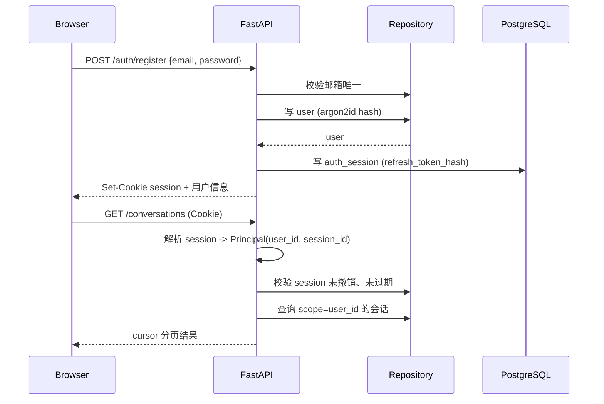

# SPEC-002：认证、用户隔离、会话与消息

## 1. 元数据

| 字段 | 值 |
|---|---|
| Spec ID | `SPEC-002` |
| 状态 | `implemented` |
| 版本 | `1.0.0` |
| 创建日期 | 2026-08-18 |
| 最后更新 | 2026-08-18 |
| 实施阶段 | `06-implementation-plan.md` 阶段 2 |
| 前置依赖 | `SPEC-001`（工程基础，状态 `partial`，真实 PostgreSQL/Redis 已可用） |
| 后续依赖 | `SPEC-003`（流式聊天与有界 Agent） |

来源：

- [产品需求](../../docs/01-product-requirements.md)：`FR-001~005`、`FR-010~012`、`FR-110~114`、`AC-001~004`、`PRD SEC-001~004/006/010/014`。
- [API、数据与安全设计](../../docs/05-api-data-security-design.md)：第 2、4、5、7、10、11、12 节。
- [技术架构](../../docs/03-technical-architecture.md)。
- [参考源码分析](../../docs/02-reference-code-analysis.md)：身份守卫（IdentityGuard）模式。
- [实施计划](../../docs/06-implementation-plan.md)：阶段 2。
- [测试计划](../../docs/07-test-plan.md)：`API-010~029`、`SEC-001~015`、`E2E-001`。

## 2. 背景与问题

`SPEC-001` 已建立可运行的工程骨架，但认证与会话仍存在以下与目标方案不一致的问题：

1. **认证方案偏离文档**：现有代码用「7 天 JWT 塞入 `access_token` Cookie」的简化实现，而文档目标方案是「服务端 session + HttpOnly Cookie，数据库只存 refresh token 哈希」，支持单设备撤销与 refresh 轮换（`05-api-data-security-design.md` 第 11.1 节）。
2. **无 session 生命周期**：没有 `auth_sessions` 表，无法撤销单设备、检测 refresh 重用或列出登录设备。
3. **用户隔离靠约定**：会话与消息查询依赖手写 `where(user_id == ...)`，没有统一的 Repository 作用域抽象，也没有 RLS 纵深防御。
4. **缺幂等与分页**：写接口没有 `Idempotency-Key` 语义，列表接口没有 cursor 分页（文档第 4 节要求）。
5. **缺 CSRF/Origin 与限流**：Cookie 认证的写接口未校验 `Origin`/`Referer`，登录与消息创建无限流（`PRD SEC-006/010/014`）。
6. **密码哈希**：现有代码使用 bcrypt，文档 `SEC-001` 推荐 Argon2id。

本 Spec 以「增量补齐」方式修正上述问题，保留现有可复用的骨架（如 request_id、统一错误、readiness），并明确记录与总体文档的偏差决策。

## 3. 目标

1. 建立基于服务端 session 的认证：注册、登录、登出、当前用户、设备列表与单设备撤销。
2. 建立 `auth_sessions` 表，保存 refresh token 哈希，支持轮换与重用检测。
3. 建立强制 `user_id` 作用域的 Repository 层，会话与消息读写均不得裸查。
4. 建立会话与消息的完整 CRUD：创建、列表（cursor 分页）、重命名、删除、消息列表与创建。
5. 为写接口建立 `Idempotency-Key` 语义。
6. 为 Cookie 认证写接口建立 CSRF/Origin 校验。
7. 为登录与消息创建建立基础限流。
8. 提供跨用户隔离的自动化测试证据。

## 4. 非目标

本步骤不实现：

- SSE 流式聊天、Agent 编排、LLM 调用（现有超前实现将由 `SPEC-003` 按规格重构，本 Spec 只保证其不被破坏且不影响认证/会话契约）。
- 记忆、工具、待办、提醒业务。
- RLS 的完整生产启用（作为纵深防御在本 Spec 提供迁移与开关位，但 Repository 强制 scope 是主防线；RLS 全量验证放 `SPEC-007`）。
- 账号删除、数据导出（`FR-006`、`FR-115` 属 P1，延后）。
- 刷新并发防无限续期的完整竞态（做基础轮换与重用检测，压测级竞态放 `SPEC-007`）。

## 5. 已确认决策

| 决策 | 内容 |
|---|---|
| 认证方案 | 服务端 session + HttpOnly Cookie，DB 存 `refresh_token_hash`，支持单设备撤销与轮换 |
| 密码哈希 | 迁移至 Argon2id（`PRD SEC-001`） |
| 范围 | 完整 P0：认证 + 会话消息 CRUD + 用户隔离 + 幂等 + cursor 分页 + CSRF/Origin + 限流 |
| 现有代码 | 增量补齐：保留可复用骨架，对齐认证与隔离契约 |

## 6. 目标目录契约

在 `SPEC-001` 目录基础上，本 Spec 新增/填充：

```text
apps/api/src/zhiban/
├── auth/
│   ├── schemas.py          # 认证请求/响应 Pydantic 模型
│   ├── service.py          # 注册/登录/轮换/登出/撤销的领域逻辑
│   ├── repository.py       # users / auth_sessions 的 scope 访问
│   ├── dependencies.py     # current_user / current_session 依赖
│   ├── security.py         # Argon2id 哈希、CSRF/Origin 校验、限流
│   └── router.py           # /auth/* 路由
├── conversations/
│   ├── schemas.py          # 会话/消息请求响应模型
│   ├── service.py          # 会话与消息领域逻辑
│   ├── repository.py       # conversations / messages 的 scope 访问
│   └── router.py           # /conversations/* 路由
├── core/
│   └── pagination.py       # cursor 编解码与分页协议
├── db/
│   └── models.py           # 扩展 User，新增 AuthSession、IdempotencyRecord
└── ...
```

## 7. 规范要求

### 7.1 认证与 Session

- **SPEC-AUTH-001** 注册 MUST 使用邮箱 + 密码，密码以 Argon2id 哈希存储，禁止明文或可逆存储。
- **SPEC-AUTH-002** 登录成功 MUST 创建 `auth_sessions` 记录，其 `refresh_token_hash` 为随机 refresh token 的单向哈希。
- **SPEC-AUTH-003** 会话凭证 MUST 通过 `HttpOnly; SameSite=Lax; Secure`（生产）且带 `__Host-` 前缀的 Cookie 下发；浏览器 JS 不得读取。
- **SPEC-AUTH-004** 受保护接口 MUST 从服务端 session 解析认证主体 `Principal(user_id, session_id)`，禁止信任 body/query 中的 `user_id`。
- **SPEC-AUTH-005** 登出 MUST 撤销当前 session，使后续请求无法再通过该凭证访问。
- **SPEC-AUTH-006** 用户 MUST 能列出并撤销自己的指定 session（单设备）。
- **SPEC-AUTH-007** refresh 轮换 MUST 使旧 token 失效，并检测重用：重用的旧 token 触发该 session 家族撤销。
- **SPEC-AUTH-008** 登录失败与未知邮箱 MUST 返回统一且不可用于枚举的提示（`AC-002`）。

### 7.2 用户隔离

- **SPEC-ISO-001** 会话与消息的读取、修改、删除 MUST 通过 Repository 强制 `user_id` 作用域，禁止提供无 scope 的 `get_by_id`。
- **SPEC-ISO-002** 跨用户对象访问 MUST 返回 404（与不存在一致），不得泄露存在性（`AC-003`）。
- **SPEC-ISO-003** 请求 DTO 使用 `extra="forbid"`，任何 `user_id/owner_id` 字段 MUST 被拒绝或忽略。
- **SPEC-ISO-004** MUST 提供 `TwoUserFixture`（用户 A/B）与跨用户读写删的自动化测试证据。

### 7.3 会话与消息

- **SPEC-CONV-001** 用户 MUST 能创建会话，默认标题为「新对话」或可空。
- **SPEC-CONV-002** 会话列表 MUST 使用 cursor 分页，按 `updated_at DESC, id DESC` 排序。
- **SPEC-CONV-003** 用户 MUST 能重命名（`PATCH`）与软删除（`DELETE`）自己的会话；删除后不再出现在列表。
- **SPEC-CONV-004** 消息列表 MUST 使用 cursor 分页，按 `created_at ASC, id ASC` 排序。
- **SPEC-CONV-005** 创建消息 MUST 校验内容非空且不超上限（默认 20000 字符）。
- **SPEC-CONV-006** 创建消息 MUST 支持 `client_message_id` 幂等去重（同一会话内唯一）。

### 7.4 幂等

- **SPEC-IDEM-001** 创建消息、Todo、Reminder、显式 Memory 等写接口 SHOULD 支持 `Idempotency-Key` 头；本 Spec 至少覆盖创建消息与创建会话。
- **SPEC-IDEM-002** 幂等作用域为 `(user_id, method, route_template, idempotency_key)`。
- **SPEC-IDEM-003** 同键同请求哈希返回原响应；同键不同哈希返回 `409 idempotency_key_reused`。
- **SPEC-IDEM-004** 幂等记录默认 TTL 24 小时，过期后可回收。

### 7.5 CSRF、Origin 与限流

- **SPEC-SEC-001** Cookie 认证的状态变更请求 MUST 校验 `Origin`/`Referer` 为允许来源，否则拒绝。
- **SPEC-SEC-002** 登录 MUST 有基础限流（默认每 IP 5 次/分钟、30 次/小时），返回 429 与 `Retry-After`。
- **SPEC-SEC-003** 创建消息 MUST 有基础限流（默认每用户 20 次/分钟）。
- **SPEC-SEC-004** Redis 不可用时限流 MUST 降级为进程内保守计数并记录降级，不得因限流失败导致请求失败。

### 7.6 数据与迁移

- **SPEC-DB-001** MUST 新增 `auth_sessions` 表（含 `refresh_token_hash`、`user_agent_hash`、`expires_at`、`revoked_at`、`last_seen_at`）。
- **SPEC-DB-002** MUST 新增 `idempotency_records` 表（含 `user_id`、`method`、`route`、`key`、`request_hash`、`response_status`、`response_body`、`expires_at`）。
- **SPEC-DB-003** `users` 表 MUST 补齐 `settings`、`privacy_settings`、`status`、`deleted_at` 字段（软删除与隐私开关基础）。
- **SPEC-DB-004** `messages` 表 MUST 补齐 `client_message_id`、`parent_message_id`、`token_count`、`metadata`、`updated_at`、`deleted_at` 字段。
- **SPEC-DB-005** `conversations` 表 MUST 补齐 `archived_at`、`deleted_at`、`version` 字段。
- **SPEC-DB-006** 迁移 MUST 保持单 head 且可 downgrade；新增迁移不得破坏 `SPEC-001` 的既有表。

### 7.7 契约与文档

- **SPEC-DOC-001** OpenAPI 契约 MUST 随变更重新生成并更新 `packages/contracts`。
- **SPEC-DOC-002** 本 Spec 的 `tasks.md` 与 `verification.md` MUST 随实现更新。
- **SPEC-DOC-003** 偏差与决策 MUST 记录于本 Spec 第 13 节，并同步受影响文档。

## 8. 行为与数据流

### 8.1 认证时序



### 8.2 Session 校验

每个受保护请求：

1. 从 Cookie 读取 session token。
2. 在 DB 中按 token 哈希查 `auth_sessions`，校验未 `revoked`、未过期。
3. 更新 `last_seen_at`（节流，避免每请求都写）。
4. 生成 `Principal(user_id, session_id)` 注入请求上下文。
5. 失败统一返回 401，不区分「无此 session」与「已过期」。

### 8.3 幂等流程

1. 请求带 `Idempotency-Key`。
2. 计算 `request_hash = SHA-256(canonical_body)`。
3. 查 `idempotency_records`：
   - 命中且 hash 相同：返回缓存响应（同状态码与 body）。
   - 命中且 hash 不同：409 `idempotency_key_reused`。
   - 未命中：写入 `state=processing` 记录，执行业务，成功后更新记录为最终响应。
4. 记录 TTL 24 小时，后台/惰性清理过期记录。

## 9. 错误与降级语义

| 场景 | 行为 |
|---|---|
| 未认证/凭证失效 | 401，统一提示，不泄露存在性 |
| 邮箱已注册 | 409 `email_taken`（注册场景）；登录失败统一 401 提示 |
| 跨用户对象访问 | 404，与不存在一致 |
| 非法 cursor | 400 `invalid_cursor` |
| 幂等键冲突 | 409 `idempotency_key_reused` |
| 限流 | 429 + `Retry-After` |
| Redis 不可用 | 限流降级为进程内计数，记录降级日志，请求不失败 |
| 数据库不可用 | 依赖 `SPEC-001` 的统一错误与 readiness；业务接口返回安全 5xx |

## 10. 安全与隐私

- 密码 Argon2id；refresh token、session token 只存哈希。
- Cookie 使用 `HttpOnly; SameSite=Lax; Path=/; Secure`（生产）+ `__Host-` 前缀。
- 日志不记录密码、token、Cookie、完整消息正文。
- `Origin`/`Referer` 校验覆盖 Cookie 认证写接口；CORS allowlist 延续 `SPEC-001`。
- 登录与消息限流防止暴力破解与资源滥用。

## 11. 验收标准

| 验收 ID | 必须结果 | 测试映射 |
|---|---|---|
| SPEC-AUTH-AC-001 | 注册后可用凭据登录，刷新后会话保持 | `API-010/011`、`AC-001` |
| SPEC-AUTH-AC-002 | 无效凭据提示不暴露账号是否存在 | `API-012`、`AC-002` |
| SPEC-AUTH-AC-003 | 登出后 session 失效 | `API-013` |
| SPEC-AUTH-AC-004 | 用户可列出并撤销指定 session | `API-014`、`FR-002` |
| SPEC-AUTH-AC-005 | refresh 重用触发家族撤销 | 本 Spec 专项测试 |
| SPEC-ISO-AC-001 | A 无法读写删 B 的会话与消息，返回 404 | `API-016/017/018`、`AC-003` |
| SPEC-ISO-AC-002 | 伪造 `user_id` 字段被拒绝 | `SEC-002` |
| SPEC-CONV-AC-001 | 创建/列表/重命名/删除会话闭环 | `API-020~022`、`FR-010/011` |
| SPEC-CONV-AC-002 | 消息创建 + 列表 + 幂等去重 | `API-023/024`、`FR-012` |
| SPEC-IDEM-AC-001 | 同键同请求返回原响应，同键不同请求 409 | 本 Spec 专项测试 |
| SPEC-PAGE-AC-001 | cursor 分页在空集/边界/最后一页正确 | `API-021`、`IT-006` |
| SPEC-SEC-AC-001 | 跨站写请求被 Origin 校验拒绝 | `SEC-006` |
| SPEC-SEC-AC-002 | 登录/消息限流返回 429 | `API-019`、`SEC-007` |
| SPEC-DB-AC-001 | 迁移单 head，可 downgrade | `IT-001/002` |

## 12. 发布与回滚

- 认证方案从 JWT 迁移到 session 是破坏性变更：前端需同步移除 `localStorage` token 依赖，改用 Cookie 自动携带。
- 迁移采用 expand/migrate/contract：先新增 `auth_sessions` 等表与字段，保留旧 JWT 路径一个过渡期（若需要），验证后移除。
- 密码哈希从 bcrypt 迁到 Argon2id：新用户直接 Argon2id；存量 bcrypt 哈希保留并在首次成功登录后惰性升级（`needs_rehash`）。
- 回滚 = 回退迁移 + 恢复前端 token 逻辑；不删除用户数据。

## 13. 偏差与决策

| 决策 | 说明 |
|---|---|
| Argon2id 替代 bcrypt | 文档 `PRD SEC-001` 要求「业界认可单向哈希」，Argon2id 为推荐值；bcrypt 仍可接受但升级更稳妥。存量 bcrypt 哈希惰性升级 |
| session 替代 JWT | 严格按 `05-api-data-security-design.md` 第 11.1 节；JWT 仅保留为可选的短期 access token 扩展位，本 Spec 默认只用 session |
| RLS 延后 | Repository 强制 scope 为主防线；RLS 迁移与开关位本 Spec 提供，全量验证放 `SPEC-007` |
| 增量补齐 | 保留 `SPEC-001` 骨架与 request_id/错误/readiness，仅重构 auth 与 conversations 以对齐契约 |
| 现有 SSE/Agent 超前实现 | 本 Spec 不删除，但 `SPEC-003` 将按规格重构；本 Spec 保证认证/隔离契约不依赖其内部细节 |

## 14. 开放问题

- 是否需要「注册」与「登录」合并为一个体验（当前前端已合并，后端保留两个端点）。
- demo 预置账号（`demo-a`/`demo-b`）的具体凭据与 seed 方式，在本 Spec 的 seed 任务中落实。
