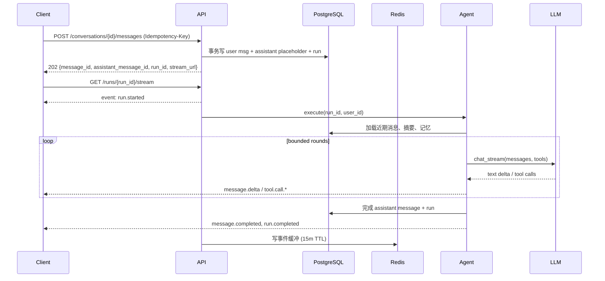

# SPEC-003：流式聊天、LLM Adapter 与有界 Agent

## 1. 元数据

| 字段 | 值 |
|---|---|
| Spec ID | `SPEC-003` |
| 状态 | `implemented` |
| 版本 | `1.0.0` |
| 创建日期 | 2026-08-18 |
| 最后更新 | 2026-08-18 |
| 实施阶段 | `06-implementation-plan.md` 阶段 3 |
| 前置依赖 | `SPEC-002`（认证、用户隔离、会话与消息，状态 `implemented`） |
| 后续依赖 | `SPEC-004`（工具运行时）、`SPEC-005`（记忆系统） |

来源：

- [产品需求](../../docs/01-product-requirements.md)：`FR-012~019`、`FR-120/124~128`、`NFR-001/003/005/006/012`、`AC-010~014/060`。
- [技术架构](../../docs/03-technical-architecture.md)：第 5、6、7、9 节。
- [记忆、上下文与工具设计](../../docs/04-memory-context-tool-design.md)：第 7、9 节。
- [API、数据与安全设计](../../docs/05-api-data-security-design.md)：第 3、4 节。
- [参考源码分析](../../docs/02-reference-code-analysis.md)：有界 ReAct、final round、流式事件、历史折叠。
- [实施计划](../../docs/06-implementation-plan.md)：阶段 3。
- [测试计划](../../docs/07-test-plan.md)：`API-030~049`、`AG-001~029`、`E2E-010~019`。

## 2. 背景与问题

`SPEC-002` 已完成认证与用户隔离，聊天 UI 目前依赖一套「超前实现」：

- `POST /conversations/{id}/chat` 内联 SSE，直接输出 `message.delta`，没有 `run` 概念、没有 `seq`、没有终态协议。
- 客户端无法区分「生成中 / 已完成 / 已停止 / 失败」，断线后无法补发或恢复。
- 没有 Token 预算：上下文按固定 20 条消息截断，无 rolling summary、无 compaction、无 flush 时机。
- Agent 循环简单，无 final round 的 `tool_choice=none` 强制、无空回复/重复输出兜底、无错误分类与有限重试。
- `llm/tools/agent` 三个模块在 `pyproject.toml` 被 mypy override 放行，存在 Protocol 协变类型债。
- LLM Adapter 未处理 Kimi K2.5 等推理模型的 `reasoning_content`，也未统一错误映射与重试。

本 Spec 以「完整 P0」方式，按文档规格重构流式聊天链路，替换超前实现。

## 3. 目标

1. 建立规范的 SSE 事件协议：单 run `seq` 递增、三种 run 终态互斥、事件类型稳定。
2. 建立「先 `POST messages` 返回 `run_id`，再 `GET /runs/{run_id}/stream`」的两段式聊天链路。
3. 建立断线重连：`Last-Event-ID` 补发，事件缓冲缺失时返回 run 快照，不重放工具副作用。
4. 建立有界 Agent 循环：最大工具轮数、总超时、final round 强制禁用工具、空回复/重复输出确定性兜底。
5. 建立 Token 预算与上下文管理：近期窗口 + rolling summary + 软/硬阈值触发 compaction。
6. 建立 LLM Adapter 的统一抽象：流式/非流式、错误分类、有限重试、`reasoning_content` 处理、usage 统计。
7. 为 rolling summary 预留独立的摘要模型配置位。
8. 移除 `pyproject.toml` 中的 mypy override，并清理已不再使用的依赖（`pyjwt`、`passlib[bcrypt]`）。

## 4. 非目标

本步骤不实现：

- 记忆系统（写入/检索）、Memory Flush 的完整实现（`SPEC-005`）；本 Spec 仅在上下文组装时为记忆预留注入点。
- 工具 Registry/Executor 的完整重构（`SPEC-004`）；本 Spec 仅将现有三个内置工具接入有界循环，不新增工具协议能力。
- 待办、提醒、搜索真实 provider、Worker（`SPEC-004/006`）。
- 用户取消的后端跨进程广播（仅实现进程内协程取消与 Redis 取消标记的预留位）。
- 生产级分布式 run 锁（单实例 + 数据库条件更新保证单执行者，跨实例放 `SPEC-007`）。

## 5. 已确认决策

| 决策 | 内容 |
|---|---|
| 范围 | 完整 P0：SSE 协议 + 两段式 + 断线重连 + Token/compaction + 有界 Agent + 移除 mypy override |
| compaction | 包含：近期窗口 + rolling summary + 软/硬阈值触发 |
| 摘要模型 | 独立配置项 `summary_llm_*`，可配更快的模型，与主对话模型分离 |

## 6. 目标目录契约

在 `SPEC-002` 基础上，本 Spec 新增/重构：

```text
apps/api/src/zhiban/
├── agent/
│   ├── orchestrator.py      # 有界循环、final round、兜底（重构）
│   ├── context.py           # Token 预算、近期窗口、rolling summary 组装
│   └── events.py            # 领域事件模型（run/message/tool 事件）
├── conversations/
│   ├── runs.py              # run 生命周期、事件缓冲、快照恢复
│   └── stream.py            # SSE 编解码、Last-Event-ID 补发
├── llm/
│   ├── base.py              # LLMAdapter 协议（协变修正）
│   ├── errors.py            # 错误分类与重试判定
│   ├── openai_adapter.py    # 推理模型 reasoning_content 处理（重构）
│   └── factory.py           # 主模型 + 摘要模型双 adapter
├── core/
│   └── token_budget.py      # Token 估算与预算分配
└── db/
    └── models.py            # 新增 agent_runs、conversation_summaries
```

## 7. 规范要求

### 7.1 SSE 事件协议

- **SPEC-AG-001** SSE 事件 MUST 使用稳定类型集合：`run.started`、`message.delta`、`tool.call.started`、`tool.call.completed`、`tool.call.failed`、`message.completed`、`run.completed`、`run.failed`、`run.cancelled`、`warning.degraded`、`ping`。
- **SPEC-AG-002** 同一 run 的事件 MUST 携带单调递增的 `seq`；SSE `id` 格式为 `{run_id}:{seq}`。
- **SPEC-AG-003** `run.completed` / `run.failed` / `run.cancelled` 三者 MUST 互斥且只出现一次。
- **SPEC-AG-004** 每个事件 MUST 包含 `event_id`、`seq`、`occurred_at`、`run_id`，可包含 `message_id`、`tool_call_id`、`data`、`error`。
- **SPEC-AG-005** `message.delta` 只承载展示态文本；最终正文以持久化的 `message.completed` 对应消息为准。
- **SPEC-AG-006** 15 秒无业务事件 MUST 发送 `ping` 心跳，避免代理空闲断开。
- **SPEC-AG-007** 已输出正文后发生错误，MUST 发送 `run.failed` 并保留部分正文，不得伪装 `run.completed`。

### 7.2 两段式聊天链路

- **SPEC-AG-010** 客户端 MUST 先 `POST /conversations/{id}/messages` 创建用户消息，返回 `202` + `message_id`、`assistant_message_id`、`run_id`、`stream_url`。
- **SPEC-AG-011** 服务端 MUST 在同一事务写入用户消息 + assistant 占位消息 + run 记录，保证 UI 可恢复。
- **SPEC-AG-012** 客户端随后 `GET /runs/{run_id}/stream` 建立 SSE。
- **SPEC-AG-013** 每个 run MUST 有唯一 `run_id`，且同一会话同一时间最多一个 active run。
- **SPEC-AG-014** SSE 断线 MUST NOT 取消 run；客户端可携带 `Last-Event-ID` 重连。

### 7.3 断线重连与恢复

- **SPEC-AG-020** 服务端 MUST 在 Redis 维护每个 run 的短期事件缓冲（默认 15 分钟 TTL）。
- **SPEC-AG-021** 重连携带 `Last-Event-ID` 时，MUST 从缓冲补发该 `seq` 之后的事件。
- **SPEC-AG-022** 缓冲缺失时，MUST 返回 `run.snapshot`（含 run 当前状态与已持久化消息终态），不得重新执行工具。
- **SPEC-AG-023** 已完成 run 的重连 MUST 直接返回最终持久化消息状态。
- **SPEC-AG-024** 恢复 MUST NOT 重放 Agent 或工具副作用。

### 7.4 有界 Agent 循环

- **SPEC-AG-030** Agent 循环 MUST 有最大工具轮数（默认 4）与总超时（默认 60 秒），均可配置。
- **SPEC-AG-031** 达到工具轮数上限后 MUST 进入 final round，`tool_choice="none"` 且不暴露工具 schema。
- **SPEC-AG-032** final round 仍返回 tool call 或空文本时，MUST 使用确定性 fallback 文本，不再调用模型。
- **SPEC-AG-033** 连续两次空回复 MUST 触发确定性兜底。
- **SPEC-AG-034** 流式输出重复片段达到阈值（连续重复 4 次或近期窗口重复）MUST 停止并记录 `output_repetition`。
- **SPEC-AG-035** 相同 `tool_name + canonical_args` 的调用在同一 run 内第二次出现 MUST 返回缓存结果不执行；连续两轮重复 MUST 进入 final round。
- **SPEC-AG-036** 工具调用总数 MUST 有上限（默认 8）。

### 7.5 Token 预算与上下文

- **SPEC-AG-040** 上下文组装顺序 MUST 为：system → rolling summary → retrieved memories → recent window → current user → tool results。
- **SPEC-AG-041** system 与 current user MUST 永不被 compaction 丢弃。
- **SPEC-AG-042** 上下文 MUST 按 Token 预算精确估算（含输出预留与工具 schema），不得用「字符数/4」作最终判断。
- **SPEC-AG-043** 软阈值 70%：调度 compaction，折叠旧工具结果，生成增量 rolling summary。
- **SPEC-AG-044** 硬阈值 85%：进入 LLM 前仍超限，MUST 同步执行 compaction 至目标 65%；失败则安全裁剪并记录降级。
- **SPEC-AG-045** 绝不压缩 current user、待确认工具调用、未成对 tool result、最近 4 个完整 turn。
- **SPEC-AG-046** rolling summary MUST 使用结构化 schema（goals/decisions/open_questions/constraints/referenced_entities/tool_facts），记录覆盖区间、模型版本与 Token 数。
- **SPEC-AG-047** 单条用户消息超预算 MUST 返回明确错误或要求缩短，不静默丢弃尾部。
- **SPEC-AG-048** 旧工具结果 MUST 折叠为结构化摘要（含 `tool_name`、关键事实、来源 URL、错误码），当前轮结果保留完整。

### 7.6 LLM Adapter

- **SPEC-AG-050** `LLMAdapter` MUST 统一流式 `chat_stream` 与非流式 `chat` 接口，返回 usage、finish_reason、tool_calls。
- **SPEC-AG-051** Adapter MUST 区分 `reasoning_content` 与 `content`，默认只把 `content` 作为回答正文，不把思考过程泄漏给用户。
- **SPEC-AG-052** Adapter MUST 统一错误分类：`validation`/`auth`/`permission`/`conflict`/`rate_limit`/`dependency_transient`/`tool_timeout`/`model_invalid`/`safety`/`internal`。
- **SPEC-AG-053** 首字节前的网络错误、408/429/5xx MUST 指数退避加抖动重试，默认最多 2 次；已发送正文后不得自动重放整轮。
- **SPEC-AG-054** 参数无效、权限拒绝、4xx（除 408/409/429）MUST NOT 重试。
- **SPEC-AG-055** 主对话模型与摘要模型 MUST 可独立配置（`summary_llm_model` 等），由 factory 分别构造。
- **SPEC-AG-056** Adapter 构造 MUST 不发起网络请求；连接在首次调用时建立。

### 7.7 错误与降级

- **SPEC-AG-060** LLM 不可用 MUST 结束 run 并返回可读错误（`run.failed` + request_id），不得伪装成功回答。
- **SPEC-AG-061** 结构化输出（tool args JSON）解析失败 MUST 至多纠正一次后降级为不执行动作的普通说明。
- **SPEC-AG-062** Redis 不可用 MUST 降级：事件仅保留当前连接，run 状态仍以数据库为准。
- **SPEC-AG-063** 工具失败 MUST 发送 `tool.call.failed` 并继续用已有信息回答，不得阻断聊天。

### 7.8 数据模型

- **SPEC-AG-070** MUST 新增 `agent_runs` 表：`id`、`user_id`、`conversation_id`、`user_message_id`、`assistant_message_id`、`status`、`route`、`model`、`tool_rounds`、`error_code`、`started_at`、`finished_at`。
- **SPEC-AG-071** `agent_runs.status` MUST 覆盖 `queued/running/waiting_confirmation/completed/failed/cancelled`。
- **SPEC-AG-072** MUST 新增 `conversation_summaries` 表：`user_id`、`conversation_id`、`from_message_id`、`through_message_id`、`summary`(jsonb)、`token_count`、`model`、`version`。
- **SPEC-AG-073** 同一会话同一时间 MUST 至多一个 active run（数据库部分唯一索引）。
- **SPEC-AG-074** `messages.status` MUST 能区分 `completed/generating/failed/cancelled`，中断轮不得被下轮误判为完成。

### 7.9 契约与类型

- **SPEC-AG-080** MUST 移除 `pyproject.toml` 中的 mypy override，`llm/tools/agent` 全部通过 strict mypy。
- **SPEC-AG-081** MUST 移除已不再使用的依赖 `pyjwt`、`passlib[bcrypt]`（SPEC-002 已迁至 Argon2id + session）。
- **SPEC-AG-082** OpenAPI 契约 MUST 重新生成并更新 `packages/contracts`。

### 7.10 前端 Markdown 渲染

- **SPEC-AG-090** 聊天界面对 assistant 回复 MUST 使用安全的 Markdown 渲染，正确显示加粗、列表、标题、行内代码、代码块、链接、表格等常见语法。
- **SPEC-AG-091** Markdown 渲染 MUST 禁用原始 HTML（不渲染 `<script>`、`` 等），防止模型输出或工具结果触发 XSS。
- **SPEC-AG-092** 外部链接 MUST 使用 `target="_blank"` + `rel="noopener noreferrer"`。
- **SPEC-AG-093** 流式生成过程中，不完整 Markdown 必须能增量渲染且不抛错、不闪断。
- **SPEC-AG-094** 用户消息默认按纯文本渲染（`whitespace-pre-wrap`），只有 assistant 回复做 Markdown 渲染。

## 8. 行为与数据流

### 8.1 两段式时序



### 8.2 有界循环状态机

```text
LoadContext -> Route -> FastLLM | Think
Think -> ValidateCalls | PersistFinal
ValidateCalls -> ExecuteTools (预算内) | FinalRound (达上限)
ExecuteTools -> Think
FinalRound -> PersistFinal (tool_choice=none)
任意路径空回复/重复/不可恢复错误 -> Fallback -> PersistFinal
```

终止条件：非空最终文本且无 tool calls；达 `max_tool_rounds`；达总超时；用户取消；重复调用；工具总数上限；连续空回复或重复输出；不可重试错误。

### 8.3 上下文组装顺序

```text
1. system           2. rolling summary
3. retrieved memories  4. recent window
5. current user     6. current-run tool results
```

## 9. 错误与降级语义

| 场景 | 行为 |
|---|---|
| LLM 网络错误/429/5xx | 首字节前退避重试 ≤2 次；仍失败 → run.failed + 可读错误 |
| 模型空回复 | 受控重试 1 次 → 确定性兜底 |
| 重复输出 | 检测并结束，不无限请求 |
| 工具参数非法 | 不执行，发送 tool.call.failed，降级说明 |
| 工具超时 | 取消执行，继续用已有信息回答 |
| Redis 不可用 | 事件仅当前连接，run 状态靠 DB |
| 断线重连 | Last-Event-ID 补发 / run.snapshot，不重放副作用 |
| 单条消息超预算 | 明确错误，不静默丢弃 |

## 10. 安全与隐私

- 事件不携带密钥、完整 Prompt、敏感工具参数。
- `reasoning_content` 默认不进日志、不进前端事件。
- 日志使用 `user_hash`，不记录消息正文。
- run 锁与事件缓冲的 Redis 键含 `run_id`，不含用户正文。
- 工具结果视为不可信数据，标记来源，不改变系统指令。

## 11. 验收标准

| 验收 ID | 必须结果 | 测试映射 |
|---|---|---|
| SPEC-AG-AC-001 | SSE 事件顺序稳定，seq 递增，终态互斥且唯一 | `API-031/032` |
| SPEC-AG-AC-002 | 两段式：POST messages 返回 202 + run_id，GET stream 正常 | `API-023/030` |
| SPEC-AG-AC-003 | 断线重连 Last-Event-ID 补发不重复副作用 | `API-035/036/037` |
| SPEC-AG-AC-004 | 已完成 run 重连返回最终状态 | `API-037` |
| SPEC-AG-AC-005 | 工具循环达上限进入 final round，不暴露工具 | `AG-016/017`、`TOOL-022/023` |
| SPEC-AG-AC-006 | 空回复/重复输出有确定性兜底 | `AG-024/025`、`E2E-015` |
| SPEC-AG-AC-007 | 重复工具调用第二次不执行 | `AG-018`、`TOOL-019~021` |
| SPEC-AG-AC-008 | Token 预算软/硬阈值触发 compaction，system/current 不丢 | `AG-001~009` |
| SPEC-AG-AC-009 | rolling summary 有结构化 schema 与覆盖区间 | `AG-008` |
| SPEC-AG-AC-010 | LLM 错误分类与重试正确，reasoning_content 不泄漏 | `AG-020~028`、`SEC-044` |
| SPEC-AG-AC-011 | 主/摘要模型可独立配置 | `UT-001`（扩展） |
| SPEC-AG-AC-012 | mypy strict 全绿，无 override | `SPEC-AG-080` |
| SPEC-AG-AC-013 | run 状态机区分 completed/failed/cancelled，中断不误判 | `API-026/041/046` |
| SPEC-AG-AC-014 | 真实 Kimi K2.5 流式对话端到端可用 | 手工 Smoke + `E2E-010` |
| SPEC-AG-AC-015 | assistant 回复正确渲染 Markdown，禁用原始 HTML，链接安全 | `SPEC-AG-090~094` |

## 12. 发布与回滚

- 两段式替代旧 `/chat` 内联 SSE 是破坏性变更：前端同步迁移到 `POST messages` + `GET stream`。
- 迁移 expand/migrate/contract：先新增 `agent_runs`/`conversation_summaries` 表与 run 端点，保留旧 `/chat` 短暂过渡，前端切换后移除。
- 回滚 = 恢复旧 `/chat` + 前端旧 client；不删除数据。
- 依赖清理（pyjwt/passlib[bcrypt]）在 `uv.lock` 同步更新。

## 13. 偏差与决策

| 决策 | 说明 |
|---|---|
| 摘要模型独立配置 | 主对话模型 kimi-k2.5 是推理模型（慢/贵），摘要用更快的模型更经济；预留 `summary_llm_*` 配置位，默认 `summary_llm_model=kimi-k2.5` 回退主模型 |
| compaction 包含在 SPEC-003 | 用户确认完整 P0，上下文 Token 控制是课题核心考察点，不放后续 |
| Token 估算用保守近似 | 中文按字符数、英文按词数，乘安全系数；不引入 tiktoken，预留 tokenizer 接口，后续实测校准 |
| 工具 Registry 完整重构延后 SPEC-004 | 本 Spec 只把现有三个工具接入有界循环，不扩展工具协议 |
| 取消广播延后 SPEC-007 | 本 Spec 做进程内协程取消 + Redis 取消标记预留，不做跨进程 |
| 移除 pyjwt/passlib[bcrypt] | SPEC-002 已迁 Argon2id + session，这两个依赖不再使用 |
| Markdown 渲染纳入 SPEC-003 | 模型天然输出 Markdown，不渲染是半成品体验；属聊天核心组成，不延后到 SPEC-007 |

## 14. 开放问题

- 前端模型选择器与后端模型白名单的最终交互（本 Spec 保留后端为准，前端仅展示）。
